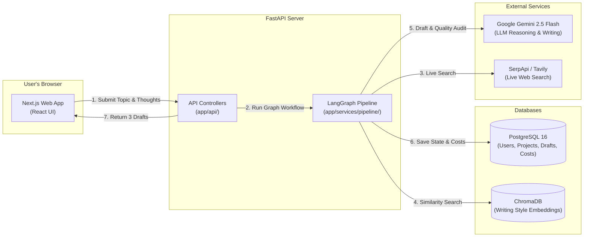
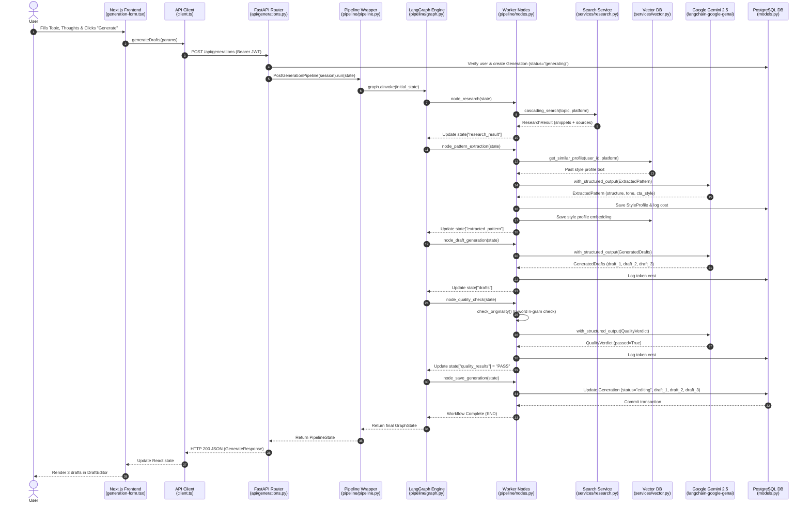
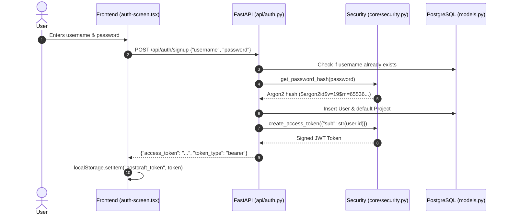
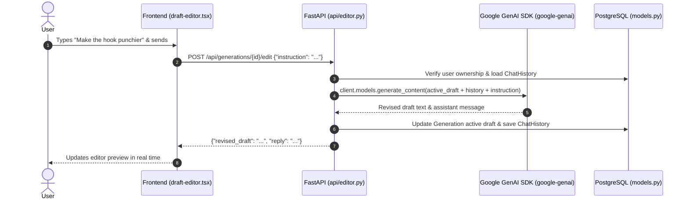
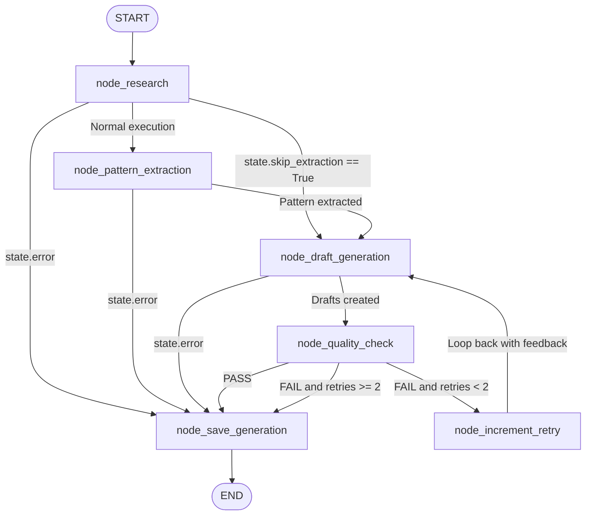
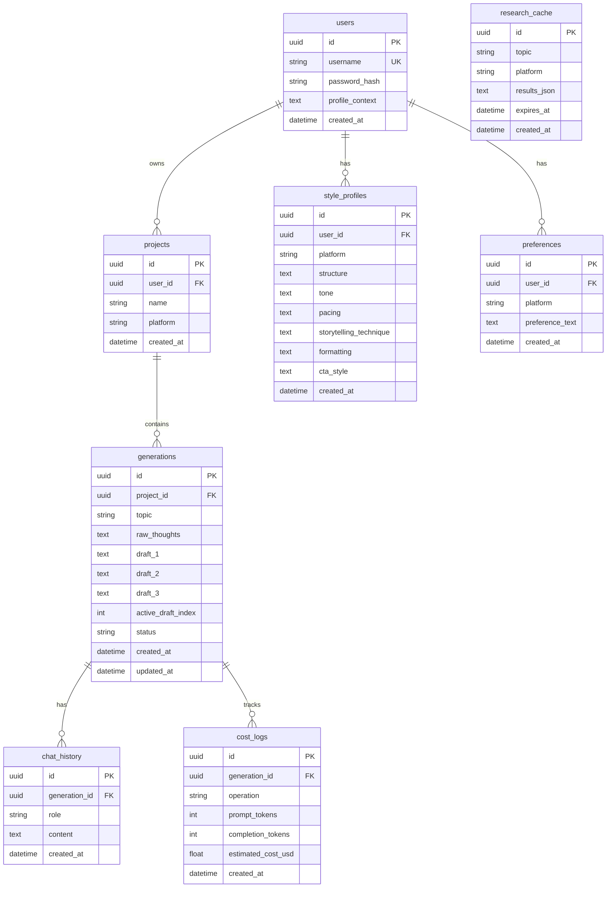

# PostCraft AI — Complete Project Mastery Guide
*A comprehensive, zero-assumption engineering guide to understanding every file, technology choice, and design decision in this codebase.*

---

## Table of Contents
1. [Part 1 — The 30,000-Foot View](#part-1--the-30000-foot-view)
2. [Part 2 — The Technology Stack & Why Each Piece Exists](#part-2--the-technology-stack--why-each-piece-exists)
3. [Part 3 — Full Repository Map](#part-3--full-repository-map)
4. [Part 4 — Trace a Real Request, Start to Finish](#part-4--trace-a-real-request-start-to-finish)
5. [Part 5 — The LangGraph Pipeline, Explained Conceptually](#part-5--the-langgraph-pipeline-explained-conceptually)
6. [Part 6 — The Product Logic: What Makes AI Output Good or Bad](#part-6--the-product-logic-what-makes-ai-output-good-or-bad)
7. [Part 7 — Database Schema, Explained Relationally](#part-7--database-schema-explained-relationally)
8. [Part 8 — Security, Rate Limiting & Account Lifecycle](#part-8--security-rate-limiting--account-lifecycle)
9. [Part 9 — Known Rough Edges and Deliberate Trade-Offs](#part-9--known-rough-edges-and-deliberate-trade-offs)
10. [Part 10 — "If You Want to Change X, Start at File Y"](#part-10--if-you-want-to-change-x-start-at-file-y)

---

# Part 1 — The 30,000-Foot View

### What is PostCraft AI?
**PostCraft AI** is an AI-powered social media ghostwriting application designed for founders, executives, engineers, and creators who want to post consistently on LinkedIn and X (Twitter) to generate business leads, build authority, or expand their network. A user types in a rough topic, some unstructured bullet points of their thoughts, and their professional background. In return, the application researches what top creators on that platform are saying about that topic, extracts structural patterns from high-performing posts, and generates three polished post drafts that follow a strict **lead-generation priority framework** ending in high-converting calls-to-action (CTAs) rather than generic discussion bait.

### Why can't you just ask a generic chatbot to do this?
When you ask a standard chatbot like ChatGPT or Gemini to "Write a LinkedIn post about remote work," it produces generic, hollow content: cliché opening hooks (*"In today's fast-paced world..."*), unverified bullet points, buzzwords, and passive questions at the end (*"What do you think? Agree or disagree?"*). 

PostCraft AI is not a single prompt call. It is an **orchestrated multi-stage engineering pipeline**:
1. **Live Grounding**: It executes live web research across Google and Tavily to collect real data, statistics, and counter-intuitive arguments.
2. **Reverse-Engineered Mechanics**: It pulls actual viral posts from curated creator datasets, stripping out their content to isolate their *underlying writing structure* (pacing, rhythm, paragraph length, and tone).
3. **Vector Style Memory**: It queries a vector database (ChromaDB) to recall how the user likes to write based on their past edits.
4. **Enforced Lead-Gen Priority**: It forces the LLM to prioritize concrete business outcomes (booking discovery calls, driving direct messages, qualifying inbound leads) over polite filler questions.
5. **Automated Quality Gatekeeping**: It runs an automated audit (n-gram plagiarism detection + LLM structural evaluation) and automatically loops back to rewrite drafts if they fail quality standards.

```text
+---------------------------------------------------------------------------------------------------+
|                                        USER'S WEB BROWSER                                         |
|   Next.js 16 (React UI) -> Enters Topic, Thoughts, Platform, Profile Context -> Clicks "Generate" |
+-------------------------------------------------+-------------------------------------------------+
                                                  |
                                                  | (HTTP POST /api/generations with Bearer JWT)
                                                  v
+---------------------------------------------------------------------------------------------------+
|                                       FASTAPI BACKEND SERVER                                      |
|   app/api/generations.py -> Authenticates User -> Inserts "generating" Record into PostgreSQL     |
|   app/services/pipeline/ -> Executes LangGraph PostGenerationPipeline State Machine               |
+---------+-------------------------------+-------------------------------+-----------------+-------+
          |                               |                               |                 |
          v (1. Live Search)              v (2. Style Similarity)         v (3. AI Drafts)  v (4. Save)
+-------------------+           +-------------------+           +-------------------+   +-------------------+
| SerpApi / Tavily  |           | ChromaDB          |           | Google Gemini     |   | PostgreSQL 16     |
| Web Search        |           | Vector Database   |           | 2.5 Flash LLM     |   | Relational DB     |
| (Grounding Data)  |           | (Past Writing)    |           | (Structured Output|   | (Users, Drafts,   |
+-------------------+           +-------------------+           +-------------------+   |  Costs, Profile)  |
                                                                                        +-------------------+
```



---

# Part 2 — The Technology Stack & Why Each Piece Exists

Every tool in our dependency tree was selected to solve a distinct engineering problem. Here is why each technology exists, what it does in PostCraft AI, and what would happen without it.

---

### 1. FastAPI (`fastapi`)
* **Category**: High-performance Python web framework for building REST APIs.
* **What it does here**: Serves as our HTTP backend. It defines API endpoints (`/api/generations`, `/api/auth`, `/api/users/me`, `/api/editor`), parses incoming JSON, runs dependency injection (database sessions, authenticated users), and formats JSON responses.
* **Why not plain Python/Flask?**: Flask is synchronous by default. When an LLM call takes 4 seconds, a synchronous server thread is completely blocked from helping any other user. FastAPI is built on ASGI (`asyncio`), allowing thousands of concurrent requests to wait for I/O (Gemini, database, search APIs) without thread exhaustion. It also automatically validates request formats using Pydantic.

---

### 2. Uvicorn (`uvicorn[standard]`)
* **Category**: ASGI (Asynchronous Server Gateway Interface) web server.
* **What it does here**: The actual web server process that listens on the network port, accepts incoming HTTP TCP sockets, and forwards them into FastAPI.
* **Why it's needed**: FastAPI is an application framework, not a web server. It defines *what to do* with a request, but Uvicorn is the engine that *receives* the request from the internet and sends back the response.

---

### 3. SQLAlchemy Async (`sqlalchemy[asyncio]` + `asyncpg`)
* **Category**: Object-Relational Mapper (ORM) and async PostgreSQL database driver.
* **What it does here**: Lets us interact with PostgreSQL tables using Python classes (`User`, `Generation`, `Project`) instead of writing raw SQL strings (`SELECT * FROM users WHERE...`).
* **Why async SQLAlchemy?**: In standard synchronous SQLAlchemy, querying the database freezes the entire Python worker thread until the database responds over the network. With `asyncio` and `asyncpg`, Python yields control to handle other requests while waiting for the database disk and network.

---

### 4. PostgreSQL
* **Category**: Production-grade relational SQL database.
* **What it does here**: Stores all structured, relational application data: user accounts, password hashes, projects, generation history, chat logs, user profile context, and token cost accounting.
* **Why not SQLite?**: SQLite locks the whole database file during write operations. In a web application where multiple users are generating posts, saving chat edits, and recording token logs simultaneously, SQLite will throw `database is locked` errors. PostgreSQL allows high-concurrency ACID transactions across separate rows and tables.

---

### 5. Alembic (`alembic`)
* **Category**: Database schema migration tool for SQLAlchemy.
* **What it does here**: Tracks changes to our database models over time (e.g., adding the `profile_context` column to the `users` table) and safely applies those changes to the live database using versioned migration scripts.
* **Why it's needed**: Without Alembic, if you add a new column to a Python model, the live database table will not automatically update. You would either have to run manual `ALTER TABLE` SQL commands against your production database by hand (risky and error-prone) or drop and recreate the whole database (destroying all user data). Alembic gives you repeatable, automated schema updates.

---

### 6. Pydantic & Pydantic-Settings (`pydantic`, `pydantic-settings`)
* **Category**: Data validation, serialization, and environment configuration management.
* **What it does here**:
  1. Validates incoming API request bodies and serializes outgoing responses.
  2. Parses `.env` environment variables into typed Python settings (`app/core/config.py`).
  3. Defines the exact JSON structure we force Google Gemini to return (`ExtractedPattern`, `GeneratedDrafts`, `QualityVerdict`).
* **Why it's needed**: Without Pydantic, you would have to manually validate every incoming dictionary (`if "topic" not in request: return 400`), parse strings to integers, handle missing keys, and hope the LLM didn't return malformed JSON.

---

### 7. ChromaDB (`chromadb`)
* **Category**: Vector database and embedding store.
* **What it does here**: Stores the mathematical representations (embeddings) of high-performing writing styles. When a user creates a new post, ChromaDB performs a similarity search to find past posts with a similar tone or structure and uses them to guide the new generation.
* **Why not standard SQL?**: SQL databases excel at exact matches (`WHERE platform = 'linkedin'`). They cannot search by *conceptual or stylistic similarity* (`Find posts that sound witty, authoritative, and concise`). Vector databases measure the geometric distance between concepts in multi-dimensional space.

---

### 8. LangGraph (`langgraph`)
* **Category**: Graph-based state machine framework for orchestrating multi-step AI agent workflows.
* **What it does here**: Defines the post-generation lifecycle as an explicit state graph of nodes (research → extraction → drafting → quality check → retry increment → save) and conditional branching edges.
* **Why not standard Python loops?**: In standard code, multi-step LLM workflows with retry loops, caching bypasses, and error short-circuits quickly turn into tangled `while` loops with nested `try/except` and boolean flags. LangGraph separates the workflow topology (how steps connect) from the worker logic (what each step does), making retries, branching, and state transitions declarative and testable.

---

### 9. LangChain Google GenAI (`langchain-google-genai`)
* **Category**: LangChain integration adapter for Google Gemini models.
* **What it does here**: Connects LangGraph nodes to Google Gemini 2.5 Flash using structured output binding (`.with_structured_output(PydanticModel, include_raw=True)`).
* **Why it's needed**: It allows us to pass a Pydantic model directly to Gemini and receive a validated Python object back, while capturing exact prompt and completion token counts from the raw response metadata for cost tracking.

---

### 10. Google GenAI SDK (`google-genai`)
* **Category**: Google's official native Python client for Gemini.
* **What it does here**: Powers the conversational draft editor (`app/api/editor.py`).
* **Why does it exist alongside LangChain?**: The conversational editor is an interactive chat loop where a user asks for quick inline tweaks ("Make the hook punchier", "Remove the second bullet point"). This was implemented as a direct SDK call rather than a graph workflow. It is intentionally kept isolated from the main generation pipeline.

---

### 11. Password Hashing with Argon2 (`passlib[argon2]`)
* **Category**: Cryptographic password hashing library.
* **What it does here**: Hashes user passwords before storing them in the database, and verifies submitted passwords during login.
* **Why Argon2 instead of SHA256 or MD5?**: Algorithms like MD5 or SHA256 are fast, which makes them vulnerable to brute-force cracking on modern GPUs (billions of guesses per second). Argon2 is the winner of the Password Hashing Competition (PHC); it is deliberately memory-hard and computationally expensive, making brute-force attacks mathematically infeasible.

---

### 12. JWT & Python-Jose (`python-jose[cryptography]`)
* **Category**: JSON Web Token encoding, signing, and verification library.
* **What it does here**: Generates a signed, cryptographically tamper-proof token string when a user logs in. The frontend attaches this token to every request header (`Authorization: Bearer <token>`).
* **Why JWT instead of server sessions?**: With server-side sessions, every API request requires looking up a session ID in a central session store (like Redis or a database table). A JWT contains the user's ID and expiration timestamp signed by our secret key. The API server can verify who the user is using math alone without making a database call for session validation.

---

### 13. Next.js 16 + React 19 (`next`, `react`, `react-dom`)
* **Category**: Full-stack React framework with App Router, server-side rendering, and asset optimization.
* **What it does here**: Powers the user interface where users log in, manage profile context, generate drafts, view research citations, edit posts in real time, and copy finished posts to their clipboard.
* **Why Next.js?**: Provides a production-grade development workflow with built-in routing, Turbopack compilation, component isolation, and automated production asset bundling.

---

### 14. Tailwind CSS + shadcn/ui (`tailwindcss`, Radix UI primitives)
* **Category**: Utility-first CSS framework combined with accessible, unstyled UI component primitives.
* **What it does here**: Provides the dark-mode styling, typography, buttons, inputs, tabs, accordions, and modal dialogs across the frontend.
* **Why shadcn/ui?**: Unlike monolithic component libraries (e.g. Material UI or Bootstrap) that ship heavy pre-packaged styles that are difficult to customize, shadcn/ui copies accessible Radix UI primitives directly into our `src/components/ui/` folder, giving us complete control over every pixel and CSS class.

---

### 15. Docker + Docker Compose
* **Category**: Containerization and local multi-service orchestration.
* **What it does here**: Packages the backend, frontend, PostgreSQL, and ChromaDB into isolated, reproducible container images so the entire stack runs identically on any computer or cloud server (Railway, AWS, local machine) with a single command (`docker compose up`).
* **Why it's needed**: Eliminates "it works on my machine" bugs caused by different Python versions, missing PostgreSQL libraries, or incompatible operating system packages.

---

### 16. `uv`
* **Category**: High-performance Python package installer and virtual environment manager (written in Rust).
* **What it does here**: Used inside our `backend/Dockerfile` to install all 120+ Python dependencies in seconds rather than minutes.

---

# Part 3 — Full Repository Map

Here is the complete, current file structure of the repository.

```
postcraft-ai/
├── docker-compose.yml              # Local multi-container development environment
├── docker-compose.prod.yml         # Production multi-container definition (Caddy TLS, no public backend/frontend ports)
├── Caddyfile                       # Caddy reverse proxy config (auto-https via Let's Encrypt)
├── README.md                       # High-level project summary and quickstart
├── PRIVACY.md                      # Privacy Policy, ToS, GDPR notes
├── DEPLOYMENT.md                   # Pre-launch security & operations checklist
├── PostCraft_AI_Complete_Documentation.md # Architecture reference and schema documentation
├── PROJECT_MASTERY_GUIDE.md        # This teaching guide
│
├── backend/
│   ├── pyproject.toml              # Backend dependencies and project metadata
│   ├── Dockerfile                  # Multi-stage container definition for backend
│   ├── start.sh                    # Runs resume-encryption migration, then uvicorn
│   ├── .dockerignore               # Files excluded from Docker build context
│   ├── alembic.ini                 # Configuration file for Alembic database migrations
│   ├── alembic/                    # Database migration scripts
│   │   ├── env.py                  # Alembic runtime environment (configures async engine)
│   │   └── versions/               # Individual migration files
│   │       ├── 4a95865efc26_init_schema.py
│   │       ├── db827654c4ab_add_password_hash.py
│   │       ├── 4b3f9cce7b2c_add_cost_log.py
│   │       ├── 3451f9589925_add_profile_context_to_user.py
│   │       └── 4c91d2e8f0a3_add_about_me_and_resumes.py
│   ├── creators/                   # Curated dataset of top viral posts
│   │   ├── linkedin.json
│   │   └── x.json
│   ├── tests/                      # Automated test suite (pytest)
│   │   ├── conftest.py             # Test fixtures, in-memory DB setup, and global mocks
│   │   ├── test_auth.py            # User signup, login, and tenant data isolation tests
│   │   ├── test_pipeline_graph.py  # LangGraph compilation & end-to-end execution test
│   │   ├── test_quality_checker.py # N-gram originality and plagiarism detection tests
│   │   └── test_research.py        # 4-tier search cache-miss and cache-hit tests
│   └── app/
│       ├── main.py                 # FastAPI entrypoint, Sentry init, security headers, TrustedHost, CORS
│       ├── models.py               # SQLAlchemy ORM table definitions (User, Generation, UserResume, etc.)
│       ├── core/                   # Infrastructure layer
│       │   ├── __init__.py         # Package exports
│       │   ├── config.py           # Pydantic Settings & environment variable validation
│       │   ├── database.py         # Async SQLAlchemy engine, session maker & get_db
│       │   ├── security.py         # Argon2 password hashing & JWT (fail-closed on missing/short secret)
│       │   ├── crypto.py           # Fernet resume encryption (fail-closed)
│       │   └── migrate_resume_encryption.py  # One-time plaintext→encrypted migration
│       ├── schemas/                # Public HTTP request/response data contracts (Pydantic)
│       │   ├── api.py              # Generation, User, Resume, Cost DTOs
│       │   ├── editor.py           # Conversational editor request/response DTOs
│       │   └── research.py         # Research result and source snippet DTOs
│       ├── api/                    # HTTP Controllers (FastAPI Routers) — all write endpoints rate-limited
│       │   ├── auth.py             # POST /api/auth/signup (3/min) and /api/auth/login (5/min)
│       │   ├── users.py            # GET/PATCH/DELETE /api/users/me, resume upload/get/delete
│       │   ├── generations.py      # POST /api/generations (10/hour)
│       │   ├── editor.py           # POST /api/generations/{id}/edit (20/hour) & /finalize (30/hour)
│       │   ├── admin.py            # GET /api/admin/cost-summary
│       │   └── health.py           # GET /api/health and /api/health/db
│       └── services/               # Domain business logic & AI engines
│           ├── research.py         # 4-tier cascading search engine (Cache -> SerpApi -> Tavily -> Synthetic)
│           ├── vector.py           # ChromaDB vector embedding & similarity search (+ delete_all_for_user)
│           ├── resume.py           # Resume text extraction (PDF/DOCX/TXT) + Gemini summarization
│           └── pipeline/           # LangGraph Post Generation State Machine
│               ├── __init__.py     # Exports PostGenerationPipeline
│               ├── deps.py         # PipelineDeps dependency injection container
│               ├── state.py        # GraphState TypedDict & structured LLM schemas
│               ├── prompts.py      # Lead-Gen prompt templates & builder functions
│               ├── nodes.py        # 6 async worker node functions
│               ├── graph.py        # StateGraph topology, async bind & conditional routers
│               ├── pipeline.py     # PostGenerationPipeline runtime entrypoint
│               └── README.md       # LangGraph developer guide
│
└── frontend/
    ├── package.json                # Frontend dependencies and scripts
    ├── Dockerfile                  # Multi-stage standalone Next.js container build
    ├── Caddyfile                   # Local Caddy config (production-like TLS termination)
    ├── next.config.ts              # Next.js configuration
    ├── tailwind.config.ts          # Tailwind CSS design tokens and theme settings
    ├── tsconfig.json               # TypeScript compiler configuration
    └── src/
        ├── app/
        │   ├── layout.tsx          # Root HTML layout with theme provider
        │   ├── page.tsx            # Main workspace — view dispatcher (home/editor/profile/history/privacy/terms)
        │   └── globals.css         # Global CSS variables and Tailwind utilities (light + dark tokens)
        ├── components/
        │   ├── layout/
        │   │   ├── app-shell.tsx     # Full sidebar + top-header wrapper
        │   │   ├── sidebar.tsx       # Nav, theme toggle, user row, legal footer links
        │   │   └── top-header.tsx    # Page title header
        │   ├── ui/                   # shadcn/ui primitives (button, dialog, card, etc.)
        │   └── theme-provider.tsx
        ├── features/
        │   ├── auth/
        │   │   ├── components/auth-screen.tsx   # Login/Signup with required ToS agreement
        │   │   └── hooks/use-auth.ts             # login / signup / logout + 429 surfacing
        │   ├── generation/
        │   │   └── components/generation-form.tsx  # Main post generation input form
        │   ├── editor/
        │   │   ├── components/draft-editor.tsx       # Live draft preview + chat
        │   │   └── components/draft-selection-grid.tsx
        │   ├── home/components/home-view.tsx         # Greeting, quick capture, recent drafts
        │   ├── history/components/history-list.tsx   # Archived generations
        │   ├── profile/components/profile-page.tsx   # Persona Engine + Danger Zone
        │   └── legal/                                 # In-app Privacy / ToS / GDPR
        │       ├── legal-content.ts                   # Bundled markdown (mirrors PRIVACY.md)
        │       └── legal-view.tsx                     # react-markdown renderer
        └── lib/
            ├── utils.ts               # CSS class merger utility (`cn`)
            ├── hooks/                 # Shared React hooks
            └── api/
                ├── client.ts          # fetchApi: JWT injection, 401 → auth-expired, 429 → specific toast
                ├── auth.ts            # Auth API calls (login, signup)
                ├── user.ts            # getCurrentUser, updateCurrentUser, deleteMyAccount
                ├── generation.ts      # generateDrafts, editDraft, finalizeDraft
                ├── history.ts         # List + load full generation
                ├── resume.ts          # Resume upload, get, delete
                └── style-profile.ts   # Style profile read
```

---

## Detailed File Breakdown

### `backend/app/core/` (Infrastructure Layer)

#### [`config.py`](file:///c:/Project/Ai%20post/backend/app/core/config.py)
* **Purpose**: Manages application settings and environment variables.
* **Dependencies**: Depends on `pydantic-settings`. Depended on by almost all backend modules.
* **Key Components**:
  * `class Settings(BaseSettings)`: Defines configuration fields (`DATABASE_URL`, `GEMINI_API_KEY`, `SERP_API_KEY`, `TAVILY_API_KEY`, `CORS_ORIGINS`).
  * `assemble_db_connection()`: Automatically rewrites standard `postgres://` or `postgresql://` connection strings to `postgresql+asyncpg://` so async SQLAlchemy can connect without manual URL tweaking.
  * `assemble_cors_origins()`: Sanitizes CORS origins from comma-separated strings or JSON arrays.
  * `get_settings()`: Cached factory function using `@lru_cache` so settings are only read from disk once.

#### [`database.py`](file:///c:/Project/Ai%20post/backend/app/core/database.py)
* **Purpose**: Sets up the async database connection engine and session factory.
* **Dependencies**: Depends on `sqlalchemy.ext.asyncio` and `app.core.config`.
* **Key Components**:
  * `class Base(DeclarativeBase)`: The parent class from which all SQLAlchemy database models inherit.
  * `_create_engine()`: Instantiates the async database engine with connection pooling.
  * `_create_session_maker()`: Creates the session factory.
  * `async def get_db()`: A FastAPI dependency generator. For each incoming HTTP request, it opens an async database session, yields it to the route handler, and closes it when the request completes.

#### [`security.py`](file:///c:/Project/Ai%20post/backend/app/core/security.py)
* **Purpose**: Handles password hashing, password verification, and JWT generation.
* **Dependencies**: Depends on `passlib` (Argon2) and `python-jose`.
* **Key Components**:
  * `verify_password(plain, hashed)`: Cryptographically checks if a plaintext password matches an Argon2 hash.
  * `get_password_hash(password)`: Hashes a plaintext password using Argon2.
  * `create_access_token(data, expires_delta)`: Encodes a user payload into a signed JWT string with an expiration timestamp.
* **Fail-closed startup contract**: `JWT_SECRET_KEY` is read at module import. If it is missing or under 32 characters, the process prints a clear `FATAL` message to stderr and `sys.exit(1)`. There is no hardcoded fallback in production — a leaked fallback would let anyone forge tokens for any user.

#### [`crypto.py`](file:///c:/Project/Ai%20post/backend/app/core/crypto.py)
* **Purpose**: Fernet-based encryption helpers for resume PII at rest.
* **Key Components**:
  * `encrypt(plaintext: str) -> str`: Encrypts using Fernet (AES-128-CBC + HMAC-SHA256). Key is sourced from `RESUME_ENCRYPTION_KEY` (URL-safe base64-encoded 32-byte key).
  * `decrypt(ciphertext: str) -> str`: Decrypts. Fail-closed: if the key is missing, the ciphertext is corrupted, or decryption raises, the function re-raises rather than silently returning a value.

#### [`migrate_resume_encryption.py`](file:///c:/Project/Ai%20post/backend/app/core/migrate_resume_encryption.py)
* **Purpose**: One-time migration that walks the `user_resumes` table, detects rows whose `raw_text` / `structured_summary` are still plaintext, and encrypts them in place. Idempotent: rows already encrypted are skipped.
* **Why it exists**: Early versions of the app stored resumes as plaintext. We don't want to lose that data, but we *do* want it encrypted from now on. This script runs at container startup (wired into `start.sh`) so any DB snapshot is brought forward to the encrypted state without manual intervention.

---

### `backend/app/models.py` (Database Models)
* **Purpose**: Defines the PostgreSQL database schema as Python classes.
* **Dependencies**: Depends on `app.core.database.Base`.
* **Tables Defined**:
  * `User`: Stores user credentials, registration date, persistent `profile_context`, and `about_me`.
  * `Project`: Groups a user's generations under a specific workspace or platform.
  * `Generation`: Stores the generated post drafts (`draft_1`, `draft_2`, `draft_3`), the active draft index, status (`generating`, `editing`, `completed`, `needs_review`, `failed`), and timestamps.
  * `StyleProfile`: Stores reverse-engineered writing patterns (structure, tone, pacing, CTA style).
  * `ChatHistory`: Stores conversational back-and-forth messages for the inline draft editor.
  * `Preference`: Stores persistent user writing preferences.
  * `UserResume`: Stores uploaded resume `raw_text` and `structured_summary` — both encrypted with Fernet before persistence. One row per user (re-upload overwrites).
  * `ResearchCache`: Caches web search results with an expiration timestamp to prevent redundant API calls.
  * `CostLog`: Records exact prompt and completion token counts and estimated USD costs for every Gemini call.
* **Cascade behavior**: User-owned rows (`UserResume`, `StyleProfile`, `Preference`, `Project` → `Generation` → `ChatHistory` and `CostLog`) are wired with `cascade="all, delete-orphan"` so `DELETE /api/users/me` cleans the entire graph in a single transaction.

---

### `backend/app/schemas/` (Data Transfer Objects)

#### [`api.py`](file:///c:/Project/Ai%20post/backend/app/schemas/api.py)
* **Purpose**: Request and response contracts for the public REST endpoints.
* **Key Models**:
  * `GenerateRequest`: What the frontend sends when creating a post (`platform`, `topic`, `raw_thoughts`, optional `profile_context`).
  * `GenerateResponse`: What the frontend receives back (generation ID, 3 drafts, active draft index, research sources).
  * `UserResponse`: Read model for user data — includes `id`, `username`, `profile_context`, and `about_me`.
  * `UserUpdate`: Patch model — allows setting `profile_context` and/or `about_me`.
  * `AccountDeleteResponse`: Simple `{ status, message }` returned after `DELETE /api/users/me`.
  * `ResumeResponse`: `{ id, filename, structured_summary, uploaded_at, raw_text_length }` — no raw text exposed to the API client.

#### [`resume.py`](file:///c:/Project/Ai%20post/backend/app/services/resume.py)
* **Purpose**: Text extraction from uploaded resume files and one-shot Gemini summarization.
* **Key Functions**:
  * `extract_text(file_bytes, mime_type)`: Handles PDF (via `pypdf`), DOCX (via `python-docx`), and plain text. Raises `ValueError` on unsupported formats or empty extraction.
  * `summarize_to_structured(raw_text, api_key)`: Calls Gemini 2.5 Flash directly (not via LangChain) to produce a structured summary JSON — role, experience highlights, skills, education — returned as a Pydantic model.

#### [`editor.py`](file:///c:/Project/Ai%20post/backend/app/schemas/editor.py)
* **Purpose**: Schemas for conversational editing and final post selection.
* **Key Models**:
  * `EditRequest`: User's prompt for tweaking a draft.
  * `EditResponse`: The revised draft text and assistant reply.
  * `FinalizeRequest`: Payload when the user selects their favorite draft and marks it finished.

#### [`research.py`](file:///c:/Project/Ai%20post/backend/app/schemas/research.py)
* **Purpose**: Schemas representing research findings.
* **Key Models**:
  * `SourceItem`: Title, URL, and snippet of a web source.
  * `ResearchResult`: Aggregated list of source items, extracted text snippets, and cache status (`cache`, `serp`, `tavily`, `synthetic`).

---

### `backend/app/api/` (HTTP Controllers)

#### [`auth.py`](file:///c:/Project/Ai%20post/backend/app/api/auth.py)
* **Purpose**: Handles user registration, authentication, and route protection.
* **Key Functions**:
  * `signup()`: Registers a new user, hashes their password with Argon2, creates a default Project, and issues a JWT.
  * `login()`: Validates credentials and returns a JWT access token.
  * `get_current_user()`: A FastAPI dependency that extracts the JWT from the `Authorization: Bearer <token>` header, decodes the user ID, loads the user from the database, and injects the user into protected endpoints.

#### [`users.py`](file:///c:/Project/Ai%20post/backend/app/api/users.py)
* **Purpose**: Manages user profile settings, resume upload/delete, and account deletion.
* **Endpoints**:
  * `GET /api/users/me`: Returns the current user's profile info, `profile_context`, and `about_me`.
  * `PATCH /api/users/me`: Updates `profile_context` and/or `about_me` in PostgreSQL.
  * `DELETE /api/users/me`: Permanently deletes the user's account and cascades to all associated data. ChromaDB vectors are cleaned first (best-effort, logged on failure); DB delete uses SQLAlchemy cascades to wipe `user_resumes`, `style_profiles`, `preferences`, `projects`, `generations`, `chat_history`, and `cost_logs`.
  * `POST /api/users/me/resume`: Accepts a PDF/DOCX/TXT upload. Parses the file to plaintext, runs a one-shot Gemini summarization, and stores both `raw_text` (Fernet-encrypted) and `structured_summary` (Fernet-encrypted) in `user_resumes`. Re-upload overwrites the previous row.
  * `GET /api/users/me/resume`: Returns filename, structured summary, and plaintext byte count (does not return raw_text).
  * `DELETE /api/users/me/resume`: Removes the resume row immediately.
  * `GET /api/users/me/style-profile`: Returns the most recent StyleProfile for a platform plus history.

#### [`generations.py`](file:///c:/Project/Ai%20post/backend/app/api/generations.py)
* **Purpose**: Main endpoint for initiating post generations.
* **Key Function**:
  * `generate_post()`: Creates a new `Generation` record with status `"generating"`, pulls the user's saved `profile_context` if none was provided in the request, builds `PipelineState`, instantiates `PostGenerationPipeline`, and runs the LangGraph workflow.

#### [`editor.py`](file:///c:/Project/Ai%20post/backend/app/api/editor.py)
* **Purpose**: Manages conversational draft refinement.
* **Key Functions**:
  * `edit_generation()`: Loads the generation, retrieves chat history, sends the edit request to Gemini using `google-genai`, updates the active draft, and records chat messages.
  * `finalize_generation()`: Marks the selected draft as `"completed"`, saves user preferences, and updates ChromaDB.

---

### `backend/app/services/pipeline/` (The LangGraph Engine)

* **[`deps.py`](file:///c:/Project/Ai%20post/backend/app/services/pipeline/deps.py)**: Dataclass holding non-serializable runtime dependencies (`session: AsyncSession`, `llm: ChatGoogleGenerativeAI`, `settings: Settings`).
* **[`state.py`](file:///c:/Project/Ai%20post/backend/app/services/pipeline/state.py)**: Defines `GraphState` (a `TypedDict` passed through the graph) and Pydantic models for structured Gemini responses (`ExtractedPattern`, `GeneratedDrafts`, `QualityVerdict`).
* **[`prompts.py`](file:///c:/Project/Ai%20post/backend/app/services/pipeline/prompts.py)**: Holds prompt templates, the **Lead-Gen Priority Framework**, platform formatting rules, and dynamic prompt-building functions.
* **[`nodes.py`](file:///c:/Project/Ai%20post/backend/app/services/pipeline/nodes.py)**: The 6 async worker functions:
  * `node_research`: Executes web search or cache lookup.
  * `node_pattern_extraction`: Reverse-engineers writing patterns from research snippets and past styles.
  * `node_draft_generation`: Generates 3 distinct drafts enforcing lead-gen CTAs and profile context.
  * `node_quality_check`: Runs n-gram originality checks and audits drafts with Gemini against `QualityVerdict`.
  * `node_increment_retry`: Increments the retry counter and logs retry reasons.
  * `node_save_generation`: Writes final drafts, statuses, and token costs to PostgreSQL.
* **[`graph.py`](file:///c:/Project/Ai%20post/backend/app/services/pipeline/graph.py)**: Assembles the LangGraph `StateGraph`, binds dependencies using async closures, and sets up conditional routing edges.
* **[`pipeline.py`](file:///c:/Project/Ai%20post/backend/app/services/pipeline/pipeline.py)**: The public entrypoint class (`PostGenerationPipeline`) that converts between public `PipelineState` and internal `GraphState`, invoking the compiled graph.

---

# Part 4 — Trace a Real Request, Start to Finish

```text
+---------------------------------------------------------------------------------------------------------+
|                                    1. USER CLICKS "GENERATE" IN BROWSER                                 |
|  frontend/src/features/generation/components/generation-form.tsx                                        |
+----------------------------------------------------+----------------------------------------------------+
                                                     |
                                                     | (HTTP POST /api/generations with Bearer JWT)
                                                     v
+---------------------------------------------------------------------------------------------------------+
|                                        2. FASTAPI ROUTE HANDLER                                         |
|  backend/app/api/generations.py -> Verifies Auth Token -> Inserts Generation (status="generating")       |
+----------------------------------------------------+----------------------------------------------------+
                                                     |
                                                     | (Passes PipelineState)
                                                     v
+---------------------------------------------------------------------------------------------------------+
|                                       3. LANGGRAPH WORKFLOW ENGINE                                      |
|  backend/app/services/pipeline/pipeline.py -> Executes Compiled StateGraph                              |
+----------------------------------------------------+----------------------------------------------------+
                                                     |
      +----------------------------------------------+----------------------------------------------+
      |                                              |                                              |
      v                                              v                                              v
+-----------------------------+        +-----------------------------+        +-----------------------------+
|    NODE 1: node_research    |        | NODE 2: node_pattern_extract|        |  NODE 3: node_draft_generate|
|                             |        |                             |        |                             |
| Checks cache in PostgreSQL; |------->| Queries ChromaDB for past   |------->| Feeds extracted pattern,    |
| Falls back to SerpApi/      |        | user style; Calls Gemini to |        | profile context, & Lead-Gen |
| Tavily for top web snippets |        | extract writing structure   |        | rules to Gemini for 3 drafts|
+-----------------------------+        +-----------------------------+        +--------------+--------------+
                                                                                             |
                                                                                             v
+-----------------------------+        +-----------------------------+        +-----------------------------+
|    NODE 5: node_save_gen    |        |   node_increment_retry      |        |  NODE 4: node_quality_check |
|                             |        |                             |        |                             |
| Writes draft_1, 2, 3 to DB; |<-------| Increments retry counter    |<-------| 6-word n-gram check + Gemini|
| Sets status = "editing";    | [PASS] | and injects failure reasons | [FAIL] | audits CTA conversion power |
| Logs all token costs to DB  |        | back into Node 3            |        |                             |
+--------------+--------------+        +-----------------------------+        +-----------------------------+
               |
               | (Returns HTTP 200 JSON Response)
               v
+---------------------------------------------------------------------------------------------------------+
|                                      4. UI RENDERS 3 POLISHED DRAFTS                                    |
|  frontend/src/features/editor/components/draft-editor.tsx                                               |
+---------------------------------------------------------------------------------------------------------+
```



---

## The Step-by-Step Walkthrough

### Step 1: User Submission in the Browser
* **File**: [`frontend/src/features/generation/components/generation-form.tsx`](file:///c:/Project/Ai%20post/frontend/src/features/generation/components/generation-form.tsx)
* **What happens**: The user selects **LinkedIn**, enters a topic (*"Why async communication beats Slack pings for engineering teams"*), adds their raw thoughts (*"Meetings disrupt flow state. 23 mins to refocus. We switched to async standups and output jumped 35%"*), and clicks **Generate**.

### Step 2: Frontend API Call
* **File**: [`frontend/src/lib/api/generation.ts`](file:///c:/Project/Ai%20post/frontend/src/lib/api/generation.ts) → [`frontend/src/lib/api/client.ts`](file:///c:/Project/Ai%20post/frontend/src/lib/api/client.ts)
* **What happens**: `generateDrafts()` gathers the form data. `fetchApi()` reads the stored JWT from `localStorage` and sends an HTTP POST request to `/api/generations` with the `Authorization: Bearer <token>` header.

### Step 3: FastAPI Controller & Database Initialization
* **File**: [`backend/app/api/generations.py`](file:///c:/Project/Ai%20post/backend/app/api/generations.py)
* **What happens**:
  1. `get_current_user` validates the JWT and loads the authenticated `User`.
  2. The endpoint checks if `req.profile_context` was sent. If empty, it automatically falls back to `current_user.profile_context` from PostgreSQL.
  3. A new `Generation` row is inserted into PostgreSQL with `status = "generating"`.
  4. A `PipelineState` object is initialized and passed into `PostGenerationPipeline(session).run(state)`.

### Step 4: LangGraph Invocation
* **File**: [`backend/app/services/pipeline/pipeline.py`](file:///c:/Project/Ai%20post/backend/app/services/pipeline/pipeline.py)
* **What happens**: `PostGenerationPipeline.run()` converts `PipelineState` into a flat `GraphState` dictionary and calls `await self.graph.ainvoke(initial_state)`.

### Step 5: Node 1 — Research (`node_research`)
* **File**: [`backend/app/services/pipeline/nodes.py`](file:///c:/Project/Ai%20post/backend/app/services/pipeline/nodes.py) → [`backend/app/services/research.py`](file:///c:/Project/Ai%20post/backend/app/services/research.py)
* **What happens**:
  1. `cascading_search()` checks PostgreSQL `research_cache` for this topic.
  2. On a cache miss, it queries **SerpApi** (Google Search). If SerpApi has no key or fails, it falls back to **Tavily Search**.
  3. It extracts 5 top content snippets and source URLs, caches them in PostgreSQL, and returns a `ResearchResult`.
  4. If a cache hit occurred and the user already had a style profile, `skip_extraction` is set to `True`.

### Step 6: Node 2 — Pattern Extraction (`node_pattern_extraction`)
* **File**: [`backend/app/services/pipeline/nodes.py`](file:///c:/Project/Ai%20post/backend/app/services/pipeline/nodes.py) → [`backend/app/services/vector.py`](file:///c:/Project/Ai%20post/backend/app/services/vector.py)
* **What happens**:
  1. `vector_service.get_similar_profile()` queries ChromaDB to find past writing styles the user liked.
  2. It formats `PATTERN_EXTRACTION_PROMPT` with the research snippets and past style bias.
  3. It calls Gemini via `llm.with_structured_output(ExtractedPattern, include_raw=True)`.
  4. Gemini returns an `ExtractedPattern` (e.g., `structure: "Hook -> Contrarian claim -> 3 bullet results -> DM CTA"`, `tone: "Direct & Authoritative"`).
  5. The extracted style is saved to PostgreSQL `style_profiles` and indexed in ChromaDB.
  6. Prompt and completion tokens are logged to PostgreSQL `cost_logs`.

### Step 7: Node 3 — Draft Generation (`node_draft_generation`)
* **File**: [`backend/app/services/pipeline/nodes.py`](file:///c:/Project/Ai%20post/backend/app/services/pipeline/nodes.py) → [`backend/app/services/pipeline/prompts.py`](file:///c:/Project/Ai%20post/backend/app/services/pipeline/prompts.py)
* **What happens**:
  1. `build_draft_prompt()` constructs the generation prompt, injecting the topic, raw thoughts, profile context, research snippets, and the **Lead-Gen CTA Rules**.
  2. The prompt explicitly commands: *"If the stylistic patterns conflict with the Lead-Gen CTA rules, the Lead-Gen rules ALWAYS WIN."*
  3. Gemini is invoked via `.with_structured_output(GeneratedDrafts, include_raw=True)`.
  4. Gemini returns 3 distinct drafts (`draft_1`, `draft_2`, `draft_3`).
  5. Token usage is logged to `cost_logs`.

### Step 8: Node 4 — Quality Check (`node_quality_check`)
* **File**: [`backend/app/services/pipeline/nodes.py`](file:///c:/Project/Ai%20post/backend/app/services/pipeline/nodes.py)
* **What happens**:
  1. **Gate 1 (Originality)**: `check_originality()` splits each draft into 6-word n-grams and compares them against the research snippets. If any 6 consecutive words match verbatim, it immediately fails with a plagiarism warning.
  2. **Gates 2 & 3 (Lead-Gen CTA & Structure)**: Gemini evaluates the drafts using `QUALITY_CHECK_PROMPT` and `.with_structured_output(QualityVerdict, include_raw=True)`. If any draft ends with generic filler (*"Thoughts?"*), `QualityVerdict.passed` is set to `False`.
  3. If all checks pass, `state["quality_results"] = "PASS"`.

### Step 9: Node 5 — Save & Finalize (`node_save_generation`)
* **File**: [`backend/app/services/pipeline/nodes.py`](file:///c:/Project/Ai%20post/backend/app/services/pipeline/nodes.py)
* **What happens**:
  1. The node loads the `Generation` record from PostgreSQL by ID.
  2. It updates `draft_1`, `draft_2`, `draft_3` and sets `status = "editing"`.
  3. It commits the transaction to PostgreSQL.

### Step 10: Response Returned to Browser
* **What happens**: FastAPI serializes the `Generation` data into a `GenerateResponse` JSON object. The frontend receives the response and renders the 3 drafts in the interactive draft editor.

---

## Secondary Flow 1: User Signup & Authentication

```text
[1. User Enters Credentials] ──► POST /api/auth/signup {"username": "...", "password": "..."}
          │
          ▼
[2. FastAPI Router: api/auth.py]
          │
          ├─► [core/security.py] ──► Hashes password with Argon2 ($argon2id$v=19$m=65536...)
          │
          ├─► [PostgreSQL]        ──► Inserts User row & default Project row
          │
          └─► [core/security.py] ──► Signs JWT with secret key: {"sub": user_id, "exp": 7 days}
          │
          ▼
[3. Browser Response] ◄── Returns {"access_token": "...", "token_type": "bearer"}
          │
          └─► Stored in localStorage -> Sent on all requests as `Authorization: Bearer <token>`
```



1. The user enters credentials in `auth-screen.tsx`.
2. `POST /api/auth/signup` receives the credentials.
3. `core/security.py` hashes the password using Argon2.
4. The user and their default project are committed to PostgreSQL.
5. A signed JWT containing the user's UUID is generated and returned.
6. The frontend stores the token in `localStorage`.
7. Future requests send `Authorization: Bearer <token>`. FastAPI's `get_current_user` dependency decodes the token and attaches the `User` object to the endpoint.

---

## Secondary Flow 2: Conversational Draft Editing

```text
[1. User Types Feedback] ──► "Make the opening hook punchier" -> Click Send
          │
          ▼
[2. POST /api/generations/{id}/edit]
          │
          ├─► Loads current active draft & previous ChatHistory from PostgreSQL
          │
          ├─► Invokes Gemini 2.5 Flash via google-genai SDK (direct conversation)
          │
          └─► Updates active draft & records user + assistant messages in PostgreSQL
          │
          ▼
[3. Browser Preview] ◄── Draft editor updates in real time with revised text
          │
          ▼ (When satisfied, user clicks "Finalize Post")
[4. POST /api/generations/{id}/finalize] ──► Sets status="completed" & saves style to ChromaDB
```



1. The user selects a draft and types an instruction in `draft-editor.tsx` (*"Make the opening line more contrarian"*).
2. `POST /api/generations/{id}/edit` verifies ownership and retrieves the active draft and past chat messages from PostgreSQL.
3. It calls Gemini directly using the `google-genai` SDK.
4. The updated draft text and assistant reply are saved to PostgreSQL and returned to the UI.
5. When satisfied, the user clicks **Finalize** (`POST /api/generations/{id}/finalize`), setting `status = "completed"`.

---

# Part 5 — The LangGraph Pipeline, Explained Conceptually

### What is a "graph-based" pipeline and why use it?
In standard procedural programming, you write workflows as linear function calls:
```python
# Procedural approach
research_data = do_research(topic)
pattern = extract_pattern(research_data)
drafts = generate_drafts(pattern)
is_valid = check_quality(drafts)
if not is_valid:
    # How do we loop back? Nested while loop? What if retry count exceeds 2?
```

When workflows involve **conditional skipping** (e.g., skip extraction on cache hits), **error short-circuits** (save and stop immediately on failure), and **cyclic retry loops** (feed failure reasons back into draft generation), imperative code quickly becomes fragile.

LangGraph allows us to express our workflow as a **Directed State Graph**:
* **State**: A single typed data contract (`GraphState`) shared across the workflow.
* **Nodes**: Isolated, testable async functions that receive state, perform work, and return state updates.
* **Edges**: Explicit routing rules that declare where execution flows next based on state data.

```text
                                     +---------+
                                     |  START  |
                                     +----+----+
                                          |
                                          v
                            +---------------------------+
                            |       node_research       |
                            +-------------+-------------+
                                          |
             +----------------------------+----------------------------+
             |                            |                            |
             v [state.error]              v [skip_extraction == True]  v [Normal path]
+---------------------------+             |              +---------------------------+
|                           |             |              |  node_pattern_extraction  |
|                           |             |              +-------------+-------------+
|                           |             |                            |
|                           |<------------+----------------------------+ [state.error]
|                           |             |                            |
|                           |             v                            v
|   node_save_generation    |       +------------------------------------+
|                           |<------|       node_draft_generation        | <------------------------+
|                           | [err] +------------------+-----------------+                          |
|                           |                          |                                            |
|                           |                          v                                            |
|                           |       +------------------------------------+                          |
|                           |       |         node_quality_check         |                          |
|                           |       +------------------+-----------------+                          |
|                           |                          |                                            |
|                           |                          +-------------------+                        |
|                           |                          |                   |                        |
|                           |<-------------------------+                   v [FAIL & retries < 2]   |
|                           | [PASS or retries >= 2]             +--------------------+             |
+-------------+-------------+                                    |node_increment_retry|-------------+
              |                                                  +--------------------+
              v
          +-------+
          |  END  |
          +-------+
```



---

### Understanding the 4 Core LangGraph Concepts

#### 1. Graph State (`GraphState`)
State is a `TypedDict` defined in `app/services/pipeline/state.py`. Every node receives the current state and returns a dictionary of updates. LangGraph merges these updates into the shared state automatically.

```python
class GraphState(TypedDict, total=False):
    generation_id: str
    user_id: str
    platform: str
    topic: str
    raw_thoughts: str
    profile_context: Optional[str]
    research_result: Optional[ResearchResult]
    extracted_pattern: Optional[ExtractedPattern]
    drafts: Optional[GeneratedDrafts]
    retry_count: int
    quality_results: Optional[str]
    error: Optional[str]
    skip_extraction: bool
```

#### 2. Worker Nodes (`nodes.py`)
A node is an async function with the signature `async def node_name(state: GraphState, deps: PipelineDeps) -> dict:`.

For example, `node_draft_generation`:
1. Reads `state["topic"]`, `state["raw_thoughts"]`, and `state["extracted_pattern"]`.
2. Checks if `state["retry_count"] > 0`. If yes, it appends `state["quality_results"]` as critical feedback to the prompt.
3. Invokes Gemini to generate 3 drafts.
4. Returns `{"drafts": drafts}`.

#### 3. Conditional Edges (`graph.py`)
Conditional edges inspect state and return the name of the next node to execute.

For example, the quality retry router:
```python
def route_after_quality_with_retry(state: GraphState) -> Literal["increment_retry", "save_generation"]:
    qr = state.get("quality_results", "")
    # If passed or empty, proceed to save
    if not qr or qr.startswith("PASS"):
        return "save_generation"
    
    # If failed and we have retries remaining (< 2), loop to increment_retry
    if state.get("retry_count", 0) < MAX_RETRIES:
        return "increment_retry"
    
    # If failed but retries are exhausted, proceed to save
    return "save_generation"
```

#### 4. The Async Closure Binding Pattern
LangGraph requires nodes to be native coroutine functions (`inspect.iscoroutinefunction()`). Passing dependencies via a plain lambda fails this check. We solve this in `graph.py` using an async closure helper:
```python
def bind(node_fn, deps: PipelineDeps):
    async def _node(state: GraphState) -> dict:
        return await node_fn(state, deps)
    return _node
```

---

# Part 6 — The Product Logic: What Makes AI Output Good or Bad

The biggest differentiator in PostCraft AI is its **Priority Hierarchy**. Standard AI post generators treat style matching as their primary goal. PostCraft AI enforces a strict 3-tier hierarchy:

```
┌─────────────────────────────────────────────────────────────┐
│ 1. LEAD-GENERATION CTA (Dominant Constraint)                │
│    Every post MUST bridge to a concrete business conversion.│
├─────────────────────────────────────────────────────────────┤
│ 2. ENGAGEMENT & REPLY-WORTHINESS                            │
│    Hooks must create curiosity gaps; claims must be bold.   │
├─────────────────────────────────────────────────────────────┤
│ 3. STYLE SEASONING (Soft Bias Only)                         │
│    Incorporate tone/pacing ONLY where it supports 1 & 2.    │
└─────────────────────────────────────────────────────────────┘
```

---

### The Concrete Difference: Verbatim Generation Output

To see why this priority framework matters, compare these real outputs generated by Google Gemini 2.5 Flash on the topic:
* **Topic**: *"Why async communication beats constant Slack pings for engineering teams"*
* **User Profile**: *"Founder of AsyncFlow (B2B SaaS helping remote engineering teams run async standups and RFC reviews). Looking to book discovery calls with VPs of Engineering and CTOs."*

#### ❌ Old Approach (Style-First, Generic Engagement Bait):
```text
Most managers fear asynchronous work. They confuse activity with output.
Six months ago, we transitioned our 15-person engineering team to async-first. The results challenge conventional wisdom:
* Slack channels cut by 50%.
* No meetings before 1 pm.
* RFCs required for any decision taking over a day.
Our velocity increased by 35%, and engineers report significantly less burnout. Real output doesn't require constant, visible activity.

Are you seeing similar resistance to async shifts, or have you found ways to overcome it?
```
* **Why it fails**: The concluding question (*"Are you seeing similar resistance...?"*) is polite filler. It produces generic comments from casual readers that never convert into business conversations.

#### ✅ New Approach (Lead-Gen Priority + Profile Context Enforced):
```text
That constant Slack notification isn't just annoying – it's costing your team 23 minutes of focused work. Every single time.
Research shows knowledge workers lose up to 23 minutes refocusing after each distraction. Multiply that by dozens of pings daily, and you're hemorrhaging productivity.
Our 15-person engineering team recognized this costly cycle. We made a strategic shift to async communication, and the impact was undeniable:
* We drastically reduced real-time interruptions, creating space for deep work.
* Major decisions are now made through documented RFCs, increasing clarity and reducing context-switching.
* Engineers report a dramatic reduction in burnout, directly correlating with fewer distractions.
The outcome? A 35% jump in project velocity. Real productivity isn't about being "always on"; it's about enabling deep, uninterrupted work.

Are you a VP of Engineering or CTO tired of seeing your team's potential eroded by constant interruptions? If you're ready to explore a proven framework for boosting output and morale, DM me to schedule a brief discovery call.
```
* **Why it succeeds**: It bridges the pain point directly to the founder's target audience (*"VP of Engineering or CTO"*) and provides a direct, high-value call-to-action (*"DM me to schedule a brief discovery call"*).

---

# Part 7 — Database Schema, Explained Relationally

```text
+-----------------------------------+             1:N             +-----------------------------------+
|               users               |----------------------------<|             projects              |
+-----------------------------------+                             +-----------------------------------+
| PK  id (UUID)                     |                             | PK  id (UUID)                     |
| UK  username (String, Index)      |                             | FK  user_id (UUID)                |
|     password_hash (Argon2)        |                             |     name (String)                 |
|     profile_context (Text)        |                             |     platform (String)             |
|     created_at (Timestamp)        |                             |     created_at (Timestamp)        |
+-----------------+-----------------+                             +-----------------+-----------------+
                  |                                                                 |
                  | 1:N                                                             | 1:N
                  v                                                                 v
+-----------------------------------+                             +-----------------------------------+
|          style_profiles           |                             |            generations            |
+-----------------------------------+                             +-----------------------------------+
| PK  id (UUID)                     |                             | PK  id (UUID)                     |
| FK  user_id (UUID)                |                             | FK  project_id (UUID)             |
|     platform (String)             |                             |     topic (String)                |
|     structure (Text)              |                             |     raw_thoughts (Text)           |
|     tone (Text)                   |                             |     draft_1, draft_2, draft_3     |
|     pacing (Text)                 |                             |     active_draft_index (Int)      |
|     storytelling_technique (Text) |                             |     status (generating/editing...) |
|     formatting (Text)             |                             |     created_at, updated_at        |
|     cta_style (Text)              |                             +-----------------+-----------------+
|     created_at (Timestamp)        |                                               |
+-----------------------------------+                             +-----------------+-----------------+
                                                                  |                                   |
                  1:N                                         1:N |                               1:N |
+-----------------------------------+                             v                                   v
|            preferences            |             +-------------------------------+   +-------------------------------+
+-----------------------------------+             |         chat_history          |   |           cost_logs           |
| PK  id (UUID)                     |             +-------------------------------+   +-------------------------------+
| FK  user_id (UUID)                |             | PK  id (UUID)                 |   | PK  id (UUID)                 |
|     platform (String)             |             | FK  generation_id (UUID)      |   | FK  generation_id (UUID)      |
|     preference_text (Text)        |             |     role (user / assistant)   |   |     operation (String)        |
|     created_at (Timestamp)        |             |     content (Text)            |   |     prompt_tokens (Int)       |
+-----------------------------------+             |     created_at (Timestamp)    |   |     completion_tokens (Int)   |
                                                  +-------------------------------+   |     estimated_cost_usd (Float)|
+-----------------------------------+                                                 |     created_at (Timestamp)    |
|          research_cache           |  (Standalone Global Cache)                      +-------------------------------+
+-----------------------------------+
| PK  id (UUID)                     |
|     topic (String, Index)         |
|     platform (String, Index)      |
|     results_json (Text)           |
|     expires_at (Timestamp)        |
|     created_at (Timestamp)        |
+-----------------------------------+
```



### Table Details & Why They Are Separate

1. **`users`**: Represents user accounts. Stores credentials and persistent `profile_context`.
2. **`projects`**: Organizes generations. A user can have separate projects for different brands or platforms.
3. **`generations`**: Represents a single post creation attempt. Holds all 3 generated drafts, active draft index, and lifecycle status (`generating` → `editing` → `completed`).
4. **`style_profiles`**: Stores extracted writing patterns. Kept separate from `generations` so historical styles can be queried across multiple projects.
5. **`chat_history`**: Stores conversational tweak requests for the inline editor, enabling multi-turn conversation context.
6. **`preferences`**: Stores explicit user preferences learned over time.
7. **`research_cache`**: Caches web search results across users to save external API costs and reduce latency.
8. **`cost_logs`**: Tracks token counts and USD costs per LLM operation for auditing and usage tracking.

---

# Part 8 — Security, Rate Limiting & Account Lifecycle

### JWT Fail-Closed Startup

`JWT_SECRET_KEY` is not optional. The module-level import in `security.py` exits the process if the key is missing or under 32 characters. This is deliberate: a hardcoded fallback in production would let anyone forge tokens for any user by simply signing up. Generate the key with `openssl rand -hex 32`.

### Fernet Resume Encryption

Resume `raw_text` and `structured_summary` are encrypted with Fernet before hitting the database. The key (`RESUME_ENCRYPTION_KEY`) is read at runtime. The `decrypt()` function re-raises on any failure — if the key is wrong or the ciphertext is corrupted, the read fails rather than returning garbage. The one-time migration (`migrate_resume_encryption.py`) converts existing plaintext rows to ciphertext at container startup.

### Rate Limiting

All write endpoints are gated by `slowapi`. The limits (5/min auth login, 3/min signup, 10/hour generation, 20/hour edit, 30/hour finalize) are documented in the API reference and surfaced specifically in the frontend — a 429 triggers a dedicated Sonner toast with the parsed `Retry-After` hint rather than a generic error.

### Account Deletion Cascade

`DELETE /api/users/me` does not merely delete the user row. The full cascade:
1. `vector_service.delete_all_for_user(user_id)` — removes ChromaDB style vectors (best-effort, logged on failure).
2. SQLAlchemy `cascade="all, delete-orphan"` on the User model covers `user_resumes`, `style_profiles`, `preferences`, `projects` → `generations` → `chat_history` and `cost_logs`.
3. The frontend's confirmation dialog requires typing the exact username — this is not a bypass; it's the UX gate that prevents accidental clicks from triggering the irreversible API call.

### Security Headers & Middleware

`main.py` applies seven layers of defense:
1. `TrustedHostMiddleware` — blocks Host-header attacks.
2. Custom `http` middleware — `Content-Security-Policy`, `X-Content-Type-Options`, `X-Frame-Options`, `Referrer-Policy`.
3. `CORSMiddleware` — configurable via `CORS_ORIGINS`.
4. Sentry — activates on `SENTRY_DSN`, sends no PII.
5. `sslmode=require` on PostgreSQL in production.
6. Caddy as the only publicly reachable service (ports 80 + 443 only).
7. HSTS via Caddy's `Strict-Transport-Security` (1-year pin).

### JWT Storage Trade-Off

Tokens are stored in `localStorage`. This is simpler than `httpOnly` cookies and works well for a small user base, but is susceptible to XSS. XSS gives the attacker `localStorage.getItem("postcraft_token")`. The mitigation chain is: DOMPurify sanitizes AI content → tokens are short-lived (7 days) → Sentry catches unusual patterns. The migration path to `httpOnly` + `SameSite=Strict` cookies is documented in `DEPLOYMENT.md` and requires a CSRF token. Acceptable to defer past a small beta, required before broad consumer launch.

---

# Part 9 — Known Rough Edges and Deliberate Trade-Offs

1. **`editor.py` Uses Raw `google-genai` Instead of LangChain**:
   * *Trade-off*: `editor.py` is a simple single-turn conversation handler. Keeping it on `google-genai` avoided overcomplicating a straightforward chat endpoint.
   * *Future improvement*: Can be migrated to `ChatGoogleGenerativeAI` for uniform dependency usage.

2. **N-gram Originality Check Scope**:
   * *Limitation*: The 6-word n-gram check in `nodes.py` catches verbatim phrase copying, but cannot catch semantic paraphrasing where words are swapped with synonyms.

3. **ChromaDB In-Process Storage**:
   * *Trade-off*: ChromaDB runs embedded in the container (`./chroma_data` volume). In large distributed deployments, an external managed vector service would be preferred.

4. **Legal Copy Sync**:
   * The canonical legal text lives in `PRIVACY.md` at the repo root. The in-app renderer (`frontend/src/features/legal/legal-content.ts`) is a separate copy that must be kept in sync manually. This is the right tradeoff for a bundled-in legal page that loads without a backend round-trip; just remember to update both files when the policy changes.

---

# Part 10 — "If You Want to Change X, Start at File Y"

| What You Want to Do | Primary File(s) to Open |
|---|---|
| **Change lead-gen CTA rules or prompt wording** | [`backend/app/services/pipeline/prompts.py`](file:///c:/Project/Ai%20post/backend/app/services/pipeline/prompts.py) |
| **Adjust quality check criteria or failure thresholds** | [`backend/app/services/pipeline/nodes.py`](file:///c:/Project/Ai%20post/backend/app/services/pipeline/nodes.py) (`node_quality_check`) |
| **Change maximum quality check retries (currently 2)** | [`backend/app/services/pipeline/nodes.py`](file:///c:/Project/Ai%20post/backend/app/services/pipeline/nodes.py) (`MAX_RETRIES`) |
| **Change the Gemini model version (e.g. 2.5 Flash → Pro)** | [`backend/app/services/pipeline/pipeline.py`](file:///c:/Project/Ai%20post/backend/app/services/pipeline/pipeline.py) (`GEMINI_MODEL`) |
| **Add a new step/node to the generation workflow** | [`backend/app/services/pipeline/graph.py`](file:///c:/Project/Ai%20post/backend/app/services/pipeline/graph.py) & [`nodes.py`](file:///c:/Project/Ai%20post/backend/app/services/pipeline/nodes.py) |
| **Add or modify database tables/columns** | [`backend/app/models.py`](file:///c:/Project/Ai%20post/backend/app/models.py) then run `alembic revision --autogenerate` |
| **Change token pricing rates for cost accounting** | [`backend/app/services/pipeline/nodes.py`](file:///c:/Project/Ai%20post/backend/app/services/pipeline/nodes.py) (`PRICE_PER_1M_...`) |
| **Update web search providers or fallback order** | [`backend/app/services/research.py`](file:///c:/Project/Ai%20post/backend/app/services/research.py) (`cascading_search`) |
| **Change JWT expiration time or hashing algorithms** | [`backend/app/core/security.py`](file:///c:/Project/Ai%20post/backend/app/core/security.py) |
| **Add new environment variables** | [`backend/app/core/config.py`](file:///c:/Project/Ai%20post/backend/app/core/config.py) (`Settings`) |
| **Modify API request/response JSON formats** | [`backend/app/schemas/api.py`](file:///c:/Project/Ai%20post/backend/app/schemas/api.py) |
| **Customize post generation form UI** | [`frontend/src/features/generation/components/generation-form.tsx`](file:///c:/Project/Ai%20post/frontend/src/features/generation/components/generation-form.tsx) |
| **Customize draft editor and conversational chat UI** | [`frontend/src/features/editor/components/draft-editor.tsx`](file:///c:/Project/Ai%20post/frontend/src/features/editor/components/draft-editor.tsx) |
| **Customize the Persona Engine / Profile page** | [`frontend/src/features/profile/components/profile-page.tsx`](file:///c:/Project/Ai%20post/frontend/src/features/profile/components/profile-page.tsx) |
| **Add or modify 429 error handling in the frontend** | [`frontend/src/lib/api/client.ts`](file:///c:/Project/Ai%20post/frontend/src/lib/api/client.ts) (parse logic) + all callers that surface errors via Sonner |
| **Modify API client fetch, token handling, and 429 surfacing** | [`frontend/src/lib/api/client.ts`](file:///c:/Project/Ai%20post/frontend/src/lib/api/client.ts) |
| **Change the legal copy (Privacy Policy / ToS / GDPR)** | [`PRIVACY.md`](file:///c:/Project/Ai%20post/PRIVACY.md) (canonical) AND [`frontend/src/features/legal/legal-content.ts`](file:///c:/Project/Ai%20post/frontend/src/features/legal/legal-content.ts) (must be kept in sync) |
| **Change how 429 errors are surfaced** | [`frontend/src/features/auth/hooks/use-auth.ts`](file:///c:/Project/Ai%20post/frontend/src/features/auth/hooks/use-auth.ts) (login/signup) and [`frontend/src/app/page.tsx`](file:///c:/Project/Ai%20post/frontend/src/app/page.tsx) (generate/edit/finalize) |
| **Add a new social media platform (e.g. Threads/Bluesky)** | [`backend/app/services/pipeline/prompts.py`](file:///c:/Project/Ai%20post/backend/app/services/pipeline/prompts.py), [`creators/`](file:///c:/Project/Ai%20post/backend/creators), and [`generation-form.tsx`](file:///c:/Project/Ai%20post/frontend/src/features/generation/components/generation-form.tsx) |
| **Change rate limits** | [`backend/app/api/auth.py`](file:///c:/Project/Ai%20post/backend/app/api/auth.py) (auth limits) and [`generations.py`](file:///c:/Project/Ai%20post/backend/app/api/generations.py) / [`editor.py`](file:///c:/Project/Ai%20post/backend/app/api/editor.py) (generation limits) |
| **Change container startup or migration commands** | [`backend/start.sh`](file:///c:/Project/Ai%20post/backend/start.sh) & [`backend/Dockerfile`](file:///c:/Project/Ai%20post/backend/Dockerfile) |
| **Migrate frontend to httpOnly cookies** | [`frontend/src/lib/api/client.ts`](file:///c:/Project/Ai%20post/frontend/src/lib/api/client.ts) (drop `Authorization` header, add `credentials: 'include'`) + [`backend/app/main.py`](file:///c:/Project/Ai%20post/backend/app/main.py) (cookie middleware) + [`DEPLOYMENT.md`](file:///c:/Project/Ai%20post/DEPLOYMENT.md) (Item E) |
| **Add or update automated tests** | [`backend/tests/`](file:///c:/Project/Ai%20post/backend/tests) |
