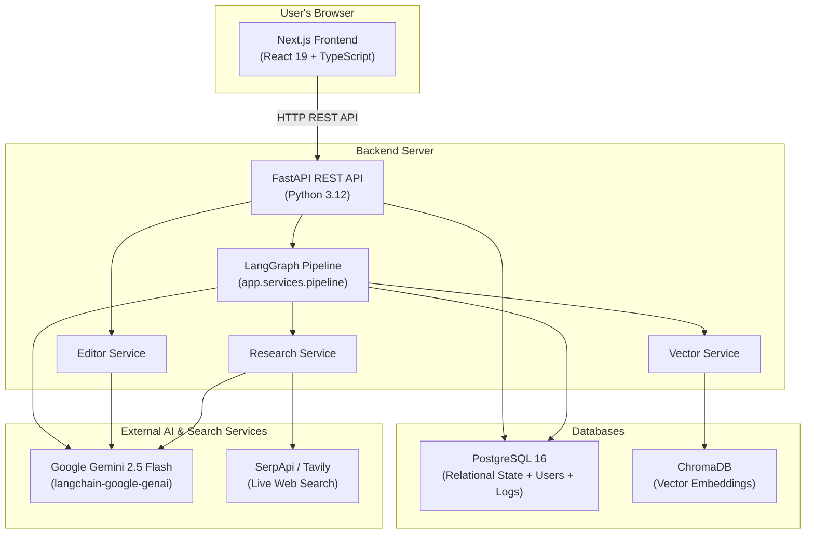
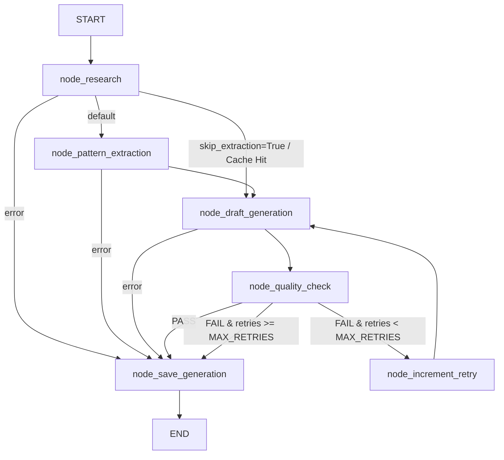
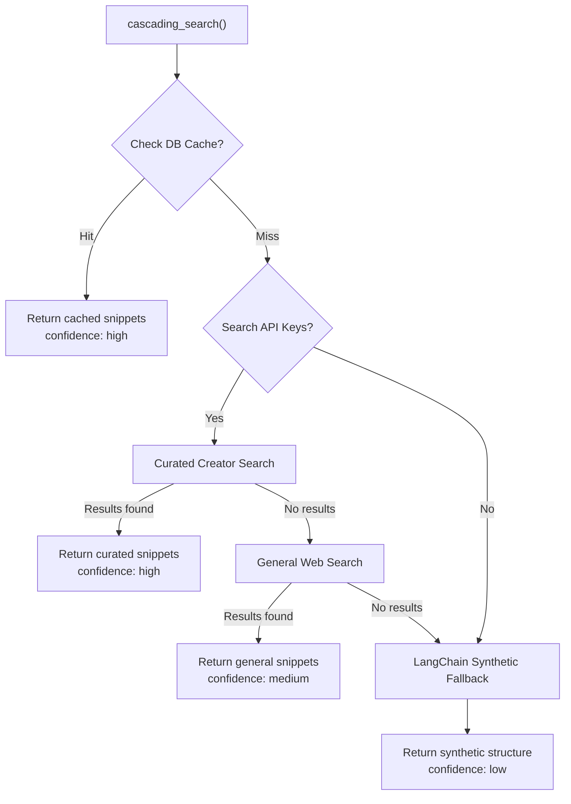
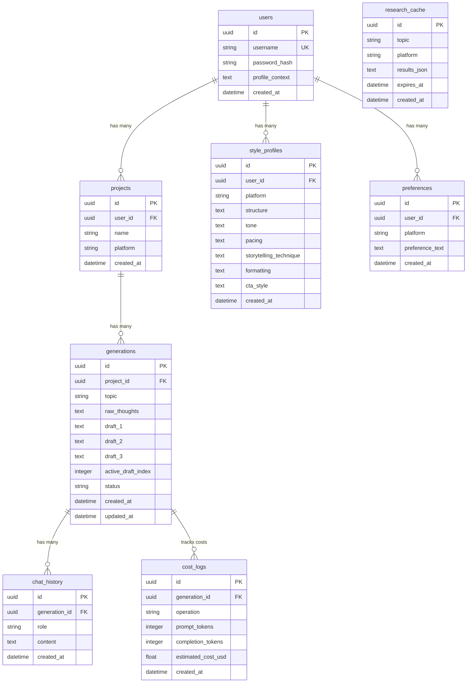

# PostCraft AI — Complete Project Documentation

> **A comprehensive guide covering the concept, architecture, and technical implementation of PostCraft AI — an AI-powered social media content generation platform powered by LangGraph and Google Gemini 2.5 Flash.**

---

## Table of Contents

1. [What is PostCraft AI?](#1-what-is-postcraft-ai)
2. [The Problem It Solves](#2-the-problem-it-solves)
3. [High-Level Architecture](#3-high-level-architecture)
4. [How Everything Connects — The Big Picture](#4-how-everything-connects--the-big-picture)
5. [The AI Content Generation Pipeline (LangGraph)](#5-the-ai-content-generation-pipeline-langgraph)
6. [The Research Engine](#6-the-research-engine)
7. [The Style Learning System (ChromaDB)](#7-the-style-learning-system-chromadb)
8. [The Conversational Editor](#8-the-conversational-editor)
9. [Database Schema](#9-database-schema)
10. [API Reference](#10-api-reference)
11. [Authentication System](#11-authentication-system)
12. [Frontend (User Interface)](#12-frontend-user-interface)
13. [Infrastructure & Deployment](#13-infrastructure--deployment)
14. [Cost Tracking](#14-cost-tracking)
15. [Technology Stack Summary](#15-technology-stack-summary)
16. [End-to-End User Journey](#16-end-to-end-user-journey)

---

## 1. What is PostCraft AI?

PostCraft AI is an intelligent social media content generation platform that helps creators, founders, and professionals produce high-converting, platform-specific posts for LinkedIn and X (formerly Twitter). Unlike generic AI writing tools that produce cookie-cutter content, PostCraft AI:

- **Orchestrates workflows via LangGraph**: Uses a typed, resilient state machine with automated quality control and feedback-driven retry loops.
- **Prioritizes Lead-Gen CTAs**: Replaces generic engagement bait ("Thoughts?", "Agree?") with conversion mechanisms tailored to the user's bio, business offering, or career goals.
- **Researches real-world content**: Discovers top creator patterns and live trends before generating drafts.
- **Learns your personal writing style**: Indexes your preferred structures in ChromaDB to bias future generations toward your voice.
- **Provides a conversational editor**: Enables fine-grained, iterative refinement of drafts with AI assistance.
- **Remembers preferences**: Extracts patterns from your manual edits to improve future generations.

The core philosophy: **the AI doesn't just write for you — it learns to write like you, while optimizing for real-world conversion.**

---

## 2. The Problem It Solves

Content creators and founders face four primary hurdles when publishing online:

| Challenge | How PostCraft AI Solves It |
|---|---|
| **Writer's block** | You provide raw thoughts and a topic; the AI structures them into 3 distinct, polished posts. |
| **Generic Engagement Bait** | Enforces a strict lead-generation priority framework, generating CTAs that drive DMs, profile visits, or qualified conversations. |
| **Platform Mismatch** | The AI tailors formatting, whitespace, and pacing specifically for LinkedIn vs. X. |
| **Impersonal AI Output** | Vector-based style learning ensures outputs match your unique voice and past preferences over time. |

---

## 3. High-Level Architecture

PostCraft AI follows a modern, decoupled architecture:



### Core Architecture Pillars

| Component | Technology | Purpose |
|---|---|---|
| **Frontend** | Next.js 16 (React 19, Tailwind CSS, shadcn/ui) | User interface for authentication, post creation, profile management, and chat editing. |
| **Backend API** | FastAPI (async Python 3.12) | High-performance asynchronous REST endpoints, JWT security, and route handling. |
| **Generation Engine** | LangGraph (`StateGraph`) | Stateful generation pipeline with conditional branching, retry caps, and quality gates. |
| **LLM Interface** | `langchain-google-genai` + Gemini 2.5 Flash | Structured outputs, function calling, pattern extraction, and automated content auditing. |
| **Vector Memory** | ChromaDB (0.5.23) | Vector embeddings of writing styles for user-specific semantic retrieval. |
| **Relational DB** | PostgreSQL 16 + SQLAlchemy (Async) | Stores users, projects, generations, chat logs, preferences, and token cost tracking. |

---

## 4. How Everything Connects — The Big Picture

```mermaid
sequenceDiagram
    autonumber
    actor User as User
    participant Frontend as Next.js UI
    participant API as FastAPI Backend
    participant Graph as LangGraph Pipeline
    participant Gemini as Gemini 2.5 Flash
    participant Chroma as ChromaDB
    participant DB as PostgreSQL

    User->>Frontend: Enter Topic, Raw Thoughts, (Optional Profile Context)
    Frontend->>API: POST /api/generations
    API->>DB: Fetch user profile_context fallback (if omitted)
    API->>DB: Create Generation record (status: "generating")
    API->>Graph: Execute PostGenerationPipeline.run(initial_state)

    rect rgb(30, 40, 60)
        Note over Graph,Gemini: LangGraph State Machine Execution
        Graph->>Graph: node_research (DB Cache -> Web Search -> Synthetic fallback)
        Graph->>Chroma: Query historical style vector for user
        Graph->>Gemini: node_pattern_extraction (Extract Scaffold: Hook, Tone, Pacing, CTA)
        Graph->>Gemini: node_draft_generation (Generate 3 Drafts with Lead-Gen Rules)
        Graph->>Gemini: node_quality_check (Validate Originality, Structure, Lead-Gen CTA)
        alt Quality Check Failed & retry_count < 2
            Graph->>Graph: node_increment_retry (Inject failure feedback)
            Graph->>Gemini: node_draft_generation (Regenerate Drafts)
        end
        Graph->>DB: node_save_generation (Save Drafts & status: "editing")
    end

    Graph-->>API: Return final PipelineState
    API-->>Frontend: Return 3 Generated Drafts + Sources
    Frontend-->>User: Display Draft Selection Grid
```



---

## 5. The AI Content Generation Pipeline (LangGraph)

The post generation pipeline is built entirely on **LangGraph** (`backend/app/services/pipeline/`), replacing legacy imperative while-loops with a typed, observable state machine.

### Pipeline Package Structure

```
backend/app/services/pipeline/
├── __init__.py          # Exports PostGenerationPipeline
├── deps.py              # PipelineDeps (AsyncSession, ChatGoogleGenerativeAI, Settings)
├── state.py             # GraphState TypedDict + Pydantic models (ExtractedPattern, GeneratedDrafts, QualityVerdict)
├── prompts.py           # Lead-Gen & Engagement prompt templates and builder functions
├── nodes.py             # 6 async worker functions (node_research, node_pattern_extraction, etc.)
├── graph.py             # StateGraph definition, async bind closures, and conditional router logic
├── pipeline.py          # PostGenerationPipeline runtime entrypoint & state mapper
└── README.md            # Architecture & LangGraph learning guide
```

### Graph Topology



### Detailed Node Specifications

#### 1. `node_research`
- Checks the `research_cache` table for recent unexpired results (24-hour TTL).
- If cached, retrieves the most recent `StyleProfile` and sets `skip_extraction = True` to bypass unnecessary LLM extraction calls.
- If un-cached, executes a cascading web search (Curated Creators → General Web Search → Synthetic generation).

#### 2. `node_pattern_extraction`
- Queries ChromaDB for the user's historical writing styles matching the topic context.
- Invokes Gemini 2.5 Flash with structured output to extract 6 stylistic dimensions:
  - **Structure**: Underlying framework (e.g. "Hook → 3 Bullets → 1-Line Takeaway → CTA").
  - **Tone**: Voice characteristics (e.g. "Direct, authoritative, contrarian").
  - **Pacing**: Rhythm (e.g. "Punchy 1-2 sentence paragraphs").
  - **Storytelling Technique**: Narrative mechanics (e.g. "Data-backed personal experience").
  - **Formatting**: Spacing and styling (e.g. "Aggressive whitespace, bullet points").
  - **CTA Style**: Historical baseline CTA framing.
- Saves the style to PostgreSQL (`StyleProfile`) and indexes it in ChromaDB.

#### 3. `node_draft_generation`
- Combines the topic, user raw thoughts, `profile_context`, research snippets, and extracted pattern.
- **Strict Content Priority Hierarchy**:
  1. **Priority #1 — Lead-Generation CTA (Dominant Constraint)**: The post MUST end with a conversion mechanism (e.g., DM invite, discovery call invitation, qualification question). Generic fillers like "Thoughts?" or "Agree?" are strictly forbidden.
  2. **Priority #2 — Engagement & Reply-Worthiness**: Concrete numbers, contrarian claims, and open loops in the hook.
  3. **Priority #3 — Style Seasoning (Soft Preference)**: Emulates extracted patterns without overriding Priorities #1 & #2.
- Generates exactly 3 distinct draft variations.

#### 4. `node_quality_check`
- **Gate 1 (Originality)**: Evaluates 6-word n-gram overlap against research snippets to prevent plagiarism.
- **Gate 2 & 3 (Structural Completeness & Lead-Gen Quality)**: An LLM-judged audit validating that all 3 drafts possess distinct Hooks, substantive Bodies, and valid Lead-Gen CTAs.
- Returns a structured `QualityVerdict` (`passed`, `failed_check`, `failed_drafts`).

#### 5. `node_increment_retry`
- Increments `retry_count` (capped by `MAX_RETRIES = 2`) and re-enters `node_draft_generation` with specific feedback injected from the previous failure.

#### 6. `node_save_generation`
- Updates the database `Generation` record with final drafts and sets status to `"editing"` (pass) or `"needs_review"` (retries exhausted).

---

## 6. The Research Engine

The Research Service (`backend/app/services/research.py`) guarantees relevant context through a 4-tier cascading search:



1. **Database Cache (Tier 1)**: Returns cached snippets within 24 hours.
2. **Curated Creator Search (Tier 2)**: Targets top influencers from `backend/creators/linkedin.json` and `x.json` (e.g., Justin Welsh, Sahil Bloom, Naval, Paul Graham) via SerpApi/Tavily.
3. **General Search (Tier 3)**: Broader web search queries when curated lists yield no matches.
4. **Synthetic Structure (Tier 4)**: Uses `ChatGoogleGenerativeAI` to simulate 3 structural examples when external search keys are unavailable.

---

## 7. The Style Learning System (ChromaDB)

PostCraft AI uses ChromaDB to maintain long-term memory of a user's writing style:

1. **Indexing**: Extracted style profiles are serialized into feature strings and stored with the user's ID and platform tag.
2. **Vector Similarity**: When a new post is generated, ChromaDB performs a cosine similarity lookup against past styles.
3. **Prompt Injection**: Closely matching past styles are injected as historical biases into the pattern extraction prompt.

---

## 8. The Conversational Editor

Following generation, users refine their chosen draft through an inline chat interface (`/api/generations/{id}/edit`):

1. **Iterative Refinement**: Users issue natural-language revision instructions (e.g., *"Shorten the hook and emphasize ROI"*).
2. **Context-Aware Editing**: The LLM edits the draft while maintaining conversation history.
3. **Preference Learning on Finalization**: Upon clicking "Finalize", the system diffs the initial draft against the final user-approved text, extracts stylistic preferences, and saves them to the `Preference` table for future generations.

---

## 9. Database Schema

PostgreSQL relational schema managed via Alembic:



---

## 10. API Reference

### Authentication Endpoints

| Method | Endpoint | Description |
|---|---|---|
| `POST` | `/api/auth/signup` | Register new user account. Returns JWT access token. |
| `POST` | `/api/auth/login` | Authenticate with credentials. Returns JWT access token. |

### User Profile Endpoints

| Method | Endpoint | Auth | Description |
|---|---|---|---|
| `GET` | `/api/users/me` | ✅ Bearer | Retrieve authenticated user details and saved `profile_context`. |
| `PATCH` | `/api/users/me` | ✅ Bearer | Update user's persistent `profile_context` (bio, target audience, business goals). |

### Content Generation Endpoints

| Method | Endpoint | Auth | Description |
|---|---|---|---|
| `POST` | `/api/generations` | ✅ Bearer | Generate 3 draft posts. Accepts `topic`, `platform`, `raw_thoughts`, and optional `profile_context`. |
| `POST` | `/api/generations/{id}/edit` | ✅ Bearer | Submit natural-language edit instruction for an active draft. |
| `POST` | `/api/generations/{id}/finalize` | ✅ Bearer | Finalize draft, save preferences, and complete generation cycle. |

### Administration & Health Endpoints

| Method | Endpoint | Auth | Description |
|---|---|---|---|
| `GET` | `/api/admin/cost-summary` | ✅ Bearer | Aggregated token usage and estimated USD cost breakdown. |
| `GET` | `/api/health` | Public | System status, version, and environment. |
| `GET` | `/api/health/db` | Public | Database connection health check. |

---

## 11. Authentication System

- **Password Hashing**: Argon2 algorithm via `passlib[argon2]`.
- **JWT Token**: Signed with HS256, 7-day expiration.
- **Interceptors**: Frontend API client automatically attaches Bearer tokens and redirects on 401 unauthenticated responses.

---

## 12. Frontend (User Interface)

Built with Next.js 16 (React 19) and structured around domain features:

```
frontend/src/
├── app/                              # Next.js App Router
│   ├── layout.tsx                    # Root layout with fonts & theme provider
│   ├── page.tsx                      # Main workspace orchestrating view states
│   └── globals.css                   # Tailwind semantic color variables
├── components/
│   ├── layout/                       # AppLayout, TopNavigation
│   └── ui/                           # shadcn/ui primitives (Button, Card, Dialog, Textarea, Badge)
├── features/
│   ├── auth/                         # AuthScreen, Login/Signup forms, useAuth hook
│   ├── generation/                   # GenerationForm, ProfileSettingsModal
│   └── editor/                       # DraftEditor, chat message components
└── lib/
    └── api/                          # client.ts, auth.ts, generation.ts, user.ts
```

### Key UI Features
- **Profile Settings Modal**: Accessible from the top navigation bar to persist global profile context.
- **Per-Generation Override**: Textarea on the main creation form allows temporary override of profile context for specific post angles.
- **Interactive Editor**: Side-by-side post viewer and chat sidebar for natural-language post revisions.

---

## 13. Infrastructure & Deployment

### Local Development (Docker Compose)

The local development stack orchestrates 3 core services:
- **`postcraft-postgres`**: PostgreSQL 16 on port `5432`
- **`postcraft-chromadb`**: ChromaDB on port `8100` (mapped from 8000)
- **`postcraft-backend`**: FastAPI application on port `8000` with hot reloading

### Production Multi-Stage Backend Dockerfile

```dockerfile
# Stage 1: Dependency builder
FROM python:3.12-slim AS builder
COPY --from=ghcr.io/astral-sh/uv:latest /uv /uvx /bin/
WORKDIR /app
COPY pyproject.toml ./
RUN uv venv /app/.venv && VIRTUAL_ENV=/app/.venv uv pip install -r pyproject.toml

# Stage 2: Minimal runtime
FROM python:3.12-slim
WORKDIR /app
COPY --from=builder /app/.venv /app/.venv
ENV PATH="/app/.venv/bin:$PATH"
COPY . .
EXPOSE 8000
CMD ["uvicorn", "app.main:app", "--host", "0.0.0.0", "--port", "8000"]
```

---

## 14. Cost Tracking

Every LLM operation is tracked in PostgreSQL `cost_logs` using Gemini 2.5 Flash pricing:
- **Input Tokens**: $0.30 per 1,000,000 tokens
- **Output Tokens**: $2.50 per 1,000,000 tokens

Operations logged: `pattern_extraction`, `draft_generation`, `quality_check`, `edit`, `finalize`.

---

## 15. Technology Stack Summary

### Backend
| Package | Version | Purpose |
|---|---|---|
| Python | 3.12 | Core runtime |
| FastAPI | Latest | Asynchronous REST framework |
| LangGraph | >=1.2.0 | Pipeline workflow state machine |
| langchain-google-genai | 2.1+ | Structured LLM outputs with Gemini 2.5 Flash |
| SQLAlchemy | 2.0+ | Asynchronous ORM |
| PostgreSQL | 16 | Relational database |
| ChromaDB | 0.5.23 | Vector database for style memory |
| Alembic | Latest | Schema migrations |
| google-genai | Latest | Retained specifically for conversational `editor.py` |

### Frontend
| Package | Version | Purpose |
|---|---|---|
| Next.js | 16 (App Router) | React application framework |
| React | 19 | UI rendering library |
| TypeScript | 5 | Type safety |
| Tailwind CSS | 3.4 | Utility-first styling |
| shadcn/ui | Latest | Accessible UI components |
| Lucide React | Latest | Iconography |
| Sonner | 2.0 | Toast notifications |

---

## 16. End-to-End User Journey

1. **User Profile Setup**: User signs in and configures their `profile_context` in Profile Settings (e.g. *"Founder of SaaS analytics tool. Target audience: Growth leads. Goal: Book demo calls"*).
2. **Topic & Thought Input**: User submits a topic (*"Why open source beats proprietary code"*) and raw thoughts.
3. **Research & Style Extraction**: The LangGraph pipeline retrieves top creator posts, checks ChromaDB for the user's historical style, and extracts writing mechanics.
4. **Draft Generation**: Gemini produces 3 distinct drafts enforcing the Lead-Gen CTA priority framework.
5. **Automated Quality Control**: The pipeline verifies originality against search snippets and validates that CTAs drive qualified actions rather than generic engagement bait.
6. **Selection & Conversational Edit**: User selects Draft 1 and asks the AI to *"Add a specific failure case in paragraph 2"*.
7. **Finalization & Continuous Learning**: User finalizes the draft. The system extracts user preferences, indexes the post style into ChromaDB, and updates PostgreSQL.
