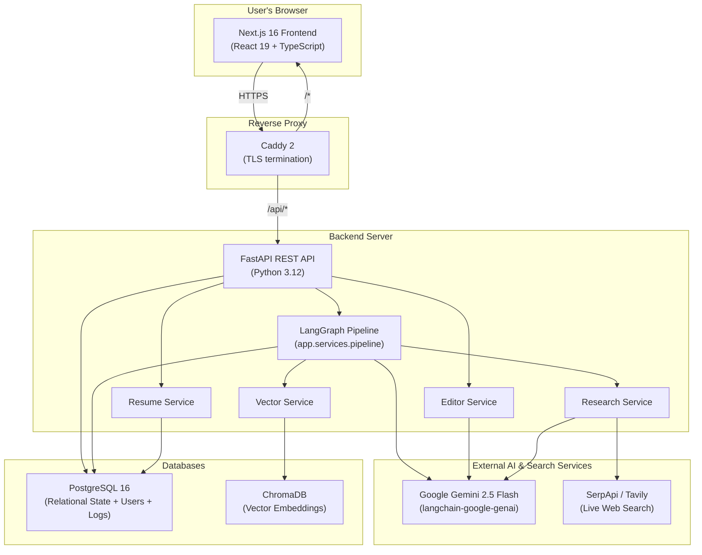
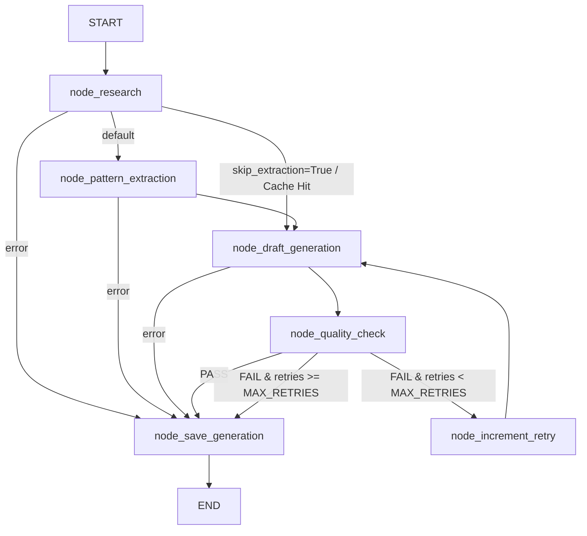
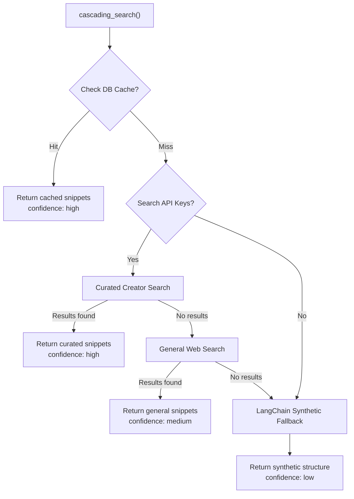
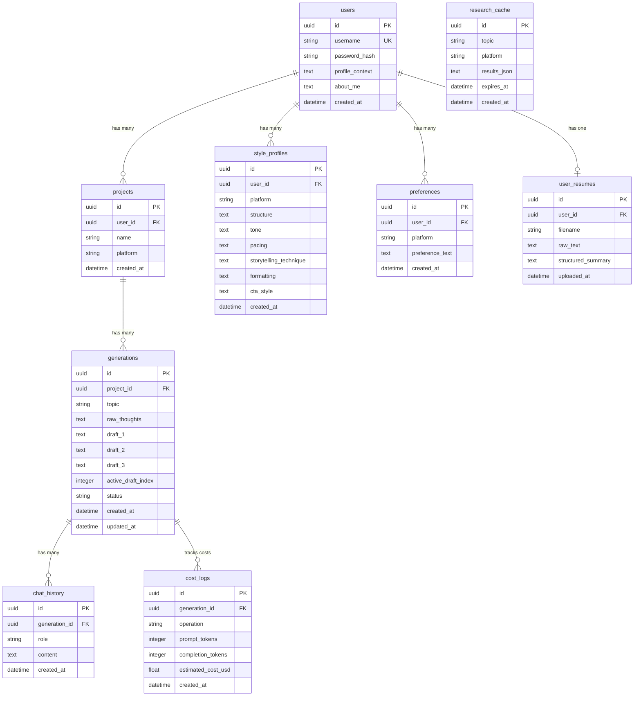

# PostCraft AI — Complete Project Documentation

> **A comprehensive guide covering the concept, architecture, and technical implementation of PostCraft AI — an AI-powered social media content generation platform powered by LangGraph and Google Gemini 2.5 Flash.**

---

## Table of Contents

1. [What is PostCraft AI?](#1-what-is-postcraft-ai)
2. [The Problem It Solves](#2-the-problem-it-solves)
3. [High-Level Architecture](#3-high-level-architecture)
4. [How Everything Connects — The Big Picture](#4-how-everything-connects--the-big-picture)
5. [The AI Content Generation Pipeline (LangGraph)](#5-the-ai-content-generation-pipeline-langgraph)
6. [The Research Engine](#6-the-research-engine)
7. [The Style Learning System (ChromaDB)](#7-the-style-learning-system-chromadb)
8. [The Conversational Editor](#8-the-conversational-editor)
9. [The Persona Engine & Resume Context](#9-the-persona-engine--resume-context)
10. [Database Schema](#10-database-schema)
11. [API Reference](#11-api-reference)
12. [Authentication System](#12-authentication-system)
13. [Rate Limiting & Abuse Protection](#13-rate-limiting--abuse-protection)
14. [Security Model](#14-security-model)
15. [Account Deletion & Data Lifecycle](#15-account-deletion--data-lifecycle)
16. [Privacy, Terms & GDPR](#16-privacy-terms--gdpr)
17. [Frontend (User Interface)](#17-frontend-user-interface)
18. [Infrastructure & Deployment](#18-infrastructure--deployment)
19. [Cost Tracking](#19-cost-tracking)
20. [Technology Stack Summary](#20-technology-stack-summary)
21. [End-to-End User Journey](#21-end-to-end-user-journey)

---

## 1. What is PostCraft AI?

PostCraft AI is an intelligent social media content generation platform that helps creators, founders, and professionals produce high-converting, platform-specific posts for LinkedIn and X (formerly Twitter). Unlike generic AI writing tools that produce cookie-cutter content, PostCraft AI:

- **Orchestrates workflows via LangGraph**: Uses a typed, resilient state machine with automated quality control and feedback-driven retry loops.
- **Prioritizes Lead-Gen CTAs**: Replaces generic engagement bait ("Thoughts?", "Agree?") with conversion mechanisms tailored to the user's bio, business offering, or career goals.
- **Researches real-world content**: Discovers top creator patterns and live trends before generating drafts.
- **Learns your personal writing style**: Indexes your preferred structures in ChromaDB to bias future generations toward your voice.
- **Provides a conversational editor**: Enables fine-grained, iterative refinement of drafts with AI assistance.
- **Remembers preferences**: Extracts patterns from your manual edits to improve future generations.
- **Persona Engine**: Structured About Me, Resume, and Writing Style fields sharpen every generation to read like you.
- **Self-serve account lifecycle**: Users can upload, encrypt, and delete their resume; full account deletion cascades to PostgreSQL and ChromaDB.
- **Privacy & ToS in-app**: Legal documents are rendered in-app, with a required sign-up agreement checkbox.

The core philosophy: **the AI doesn't just write for you — it learns to write like you, while optimizing for real-world conversion.**

---

## 2. The Problem It Solves

Content creators and founders face four primary hurdles when publishing online:

| Challenge | How PostCraft AI Solves It |
|---|---|
| **Writer's block** | You provide raw thoughts and a topic; the AI structures them into 3 distinct, polished posts. |
| **Generic Engagement Bait** | Enforces a strict lead-generation priority framework, generating CTAs that drive DMs, profile visits, or qualified conversations. |
| **Platform Mismatch** | The AI tailors formatting, whitespace, and pacing specifically for LinkedIn vs. X. |
| **Impersonal AI Output** | Vector-based style learning ensures outputs match your unique voice and past preferences over time. |
| **Repetitive prompts** | Cascading research engine grounds drafts in real, current, public discourse. |

---

## 3. High-Level Architecture

PostCraft AI follows a modern, decoupled architecture:



### Core Architecture Pillars

| Component | Technology | Purpose |
|---|---|---|
| **Frontend** | Next.js 16 (React 19, Tailwind CSS, shadcn/ui) | User interface for authentication, post creation, profile management, chat editing, and legal pages. |
| **Backend API** | FastAPI (async Python 3.12) | High-performance asynchronous REST endpoints, JWT security, rate limiting, security headers. |
| **Generation Engine** | LangGraph (`StateGraph`) | Stateful generation pipeline with conditional branching, retry caps, and quality gates. |
| **LLM Interface** | `langchain-google-genai` + Gemini 2.5 Flash | Structured outputs, function calling, pattern extraction, and automated content auditing. |
| **Vector Memory** | ChromaDB (0.5.23) | Vector embeddings of writing styles for user-specific semantic retrieval. |
| **Relational DB** | PostgreSQL 16 + SQLAlchemy (Async) | Stores users, projects, generations, chat logs, preferences, resumes, and token cost tracking. |
| **Reverse Proxy** | Caddy 2 | Automatic Let's Encrypt cert issuance and renewal; only public service in production. |
| **Error Monitoring** | Sentry (optional) | Activates when `SENTRY_DSN` is set; never sends PII. |

---

## 4. How Everything Connects — The Big Picture

```mermaid
sequenceDiagram
    autonumber
    actor User as User
    participant Frontend as Next.js UI
    participant API as FastAPI Backend
    participant Graph as LangGraph Pipeline
    participant Gemini as Gemini 2.5 Flash
    participant Chroma as ChromaDB
    participant DB as PostgreSQL

    User->>Frontend: Enter Topic, Raw Thoughts, (Optional Profile Context)
    Frontend->>API: POST /api/generations
    API->>DB: Fetch user profile_context fallback (if omitted)
    API->>DB: Create Generation record (status: "generating")
    API->>Graph: Execute PostGenerationPipeline.run(initial_state)

    rect rgb(30, 40, 60)
        Note over Graph,Gemini: LangGraph State Machine Execution
        Graph->>Graph: node_research (DB Cache -> Web Search -> Synthetic fallback)
        Graph->>Chroma: Query historical style vector for user
        Graph->>Gemini: node_pattern_extraction (Extract Scaffold: Hook, Tone, Pacing, CTA)
        Graph->>Gemini: node_draft_generation (Generate 3 Drafts with Lead-Gen Rules)
        Graph->>Gemini: node_quality_check (Validate Originality, Structure, Lead-Gen CTA)
        alt Quality Check Failed & retry_count < 2
            Graph->>Graph: node_increment_retry (Inject failure feedback)
            Graph->>Gemini: node_draft_generation (Regenerate Drafts)
        end
        Graph->>DB: node_save_generation (Save Drafts & status: "editing")
    end

    Graph-->>API: Return final PipelineState
    API-->>Frontend: Return 3 Generated Drafts + Sources
    Frontend-->>User: Display Draft Selection Grid
```



---

## 5. The AI Content Generation Pipeline (LangGraph)

The post generation pipeline is built entirely on **LangGraph** (`backend/app/services/pipeline/`), replacing legacy imperative while-loops with a typed, observable state machine.

### Pipeline Package Structure

```
backend/app/services/pipeline/
├── __init__.py          # Exports PostGenerationPipeline
├── deps.py              # PipelineDeps (AsyncSession, ChatGoogleGenerativeAI, Settings)
├── state.py             # GraphState TypedDict + Pydantic models (ExtractedPattern, GeneratedDrafts, QualityVerdict)
├── prompts.py           # Lead-Gen & Engagement prompt templates and builder functions
├── nodes.py             # 6 async worker functions (node_research, node_pattern_extraction, etc.)
├── graph.py             # StateGraph definition, async bind closures, and conditional router logic
├── pipeline.py          # PostGenerationPipeline runtime entrypoint & state mapper
└── README.md            # Architecture & LangGraph learning guide
```

### Graph Topology



### Detailed Node Specifications

#### 1. `node_research`
- Checks the `research_cache` table for recent unexpired results (24-hour TTL).
- If cached, retrieves the most recent `StyleProfile` and sets `skip_extraction = True` to bypass unnecessary LLM extraction calls.
- If un-cached, executes a cascading web search (Curated Creators → General Web Search → Synthetic generation).

#### 2. `node_pattern_extraction`
- Queries ChromaDB for the user's historical writing styles matching the topic context.
- Invokes Gemini 2.5 Flash with structured output to extract 6 stylistic dimensions:
  - **Structure**: Underlying framework (e.g. "Hook → 3 Bullets → 1-Line Takeaway → CTA").
  - **Tone**: Voice characteristics (e.g. "Direct, authoritative, contrarian").
  - **Pacing**: Rhythm (e.g. "Punchy 1-2 sentence paragraphs").
  - **Storytelling Technique**: Narrative mechanics (e.g. "Data-backed personal experience").
  - **Formatting**: Spacing and styling (e.g. "Aggressive whitespace, bullet points").
  - **CTA Style**: Historical baseline CTA framing.
- Saves the style to PostgreSQL (`StyleProfile`) and indexes it in ChromaDB.

#### 3. `node_draft_generation`
- Combines the topic, user raw thoughts, `profile_context`, research snippets, and extracted pattern.
- **Strict Content Priority Hierarchy**:
  1. **Priority #1 — Lead-Generation CTA (Dominant Constraint)**: The post MUST end with a conversion mechanism (e.g., DM invite, discovery call invitation, qualification question). Generic fillers like "Thoughts?" or "Agree?" are strictly forbidden.
  2. **Priority #2 — Engagement & Reply-Worthiness**: Concrete numbers, contrarian claims, and open loops in the hook.
  3. **Priority #3 — Style Seasoning (Soft Preference)**: Emulates extracted patterns without overriding Priorities #1 & #2.
- Generates exactly 3 distinct draft variations.

#### 4. `node_quality_check`
- **Gate 1 (Originality)**: Evaluates 6-word n-gram overlap against research snippets to prevent plagiarism.
- **Gate 2 & 3 (Structural Completeness & Lead-Gen Quality)**: An LLM-judged audit validating that all 3 drafts possess distinct Hooks, substantive Bodies, and valid Lead-Gen CTAs.
- Returns a structured `QualityVerdict` (`passed`, `failed_check`, `failed_drafts`).

#### 5. `node_increment_retry`
- Increments `retry_count` (capped by `MAX_RETRIES = 2`) and re-enters `node_draft_generation` with specific feedback injected from the previous failure.

#### 6. `node_save_generation`
- Updates the database `Generation` record with final drafts and sets status to `"editing"` (pass) or `"needs_review"` (retries exhausted).

---

## 6. The Research Engine

The Research Service (`backend/app/services/research.py`) guarantees relevant context through a 4-tier cascading search:



1. **Database Cache (Tier 1)**: Returns cached snippets within 24 hours.
2. **Curated Creator Search (Tier 2)**: Targets top influencers from `backend/creators/linkedin.json` and `x.json` (e.g., Justin Welsh, Sahil Bloom, Naval, Paul Graham) via SerpApi/Tavily.
3. **General Search (Tier 3)**: Broader web search queries when curated lists yield no matches.
4. **Synthetic Structure (Tier 4)**: Uses `ChatGoogleGenerativeAI` to simulate 3 structural examples when external search keys are unavailable.

---

## 7. The Style Learning System (ChromaDB)

PostCraft AI uses ChromaDB to maintain long-term memory of a user's writing style:

1. **Indexing**: Extracted style profiles are serialized into feature strings and stored with the user's ID and platform tag.
2. **Vector Similarity**: When a new post is generated, ChromaDB performs a cosine similarity lookup against past styles.
3. **Prompt Injection**: Closely matching past styles are injected as historical biases into the pattern extraction prompt.
4. **Cascade on account deletion**: When a user deletes their account, `vector_service.delete_all_for_user(user_id)` is called **before** the DB delete so a stable user_id reference is available.

---

## 8. The Conversational Editor

Following generation, users refine their chosen draft through an inline chat interface (`/api/generations/{id}/edit`):

1. **Iterative Refinement**: Users issue natural-language revision instructions (e.g., *"Shorten the hook and emphasize ROI"*).
2. **Context-Aware Editing**: The LLM edits the draft while maintaining conversation history.
3. **Rate-Limited**: 20 edits / hour / user.
4. **Preference Learning on Finalization**: Upon clicking "Finalize" (30 / hour / user), the system diffs the initial draft against the final user-approved text, extracts stylistic preferences, and saves them to the `Preference` table for future generations.

---

## 9. The Persona Engine & Resume Context

The **Persona Engine** is the in-app profile configuration surface (`frontend/src/features/profile/`). It collects three structured fields that sharpen every generation:

| Field | Source | Used For |
|---|---|---|
| **About Me** | Free-text user input (`users.about_me`) | Identity signal for the LLM — who you write for and what you stand for. |
| **Resume & Background** | Free-text user input OR uploaded resume (`users.profile_context` + `user_resumes`) | Professional grounding; the LLM pulls real experience into posts. |
| **Writing Style Profile** | Free-text user input | Tone, cadence, vocabulary, anti-patterns ("no em-dashes", "no 'delve'"). |

### Resume Upload & Encryption

- Users can upload a PDF/DOCX/TXT resume (5 MB cap).
- `app/services/resume.py` extracts raw text (`extract_text`) and produces a structured summary once via Gemini (`summarize_to_structured`).
- Both `raw_text` and `structured_summary` are **encrypted at rest with Fernet** (AES-128-CBC + HMAC-SHA256) before persistence. The Fernet key is sourced from `RESUME_ENCRYPTION_KEY`.
- Decryption is fail-closed: if the key is absent or the ciphertext is corrupted, the operation raises rather than silently returning plaintext.
- Re-uploading overwrites the previous resume (single-resume model per user).
- Users can delete their resume independently of account deletion via `DELETE /api/users/me/resume`.

### One-Time Migration

`backend/app/core/migrate_resume_encryption.py` walks the `user_resumes` table at startup, detects plaintext rows, and encrypts them in place. Wired into `start.sh` so it runs before `uvicorn` on every container boot — idempotent and safe to re-run.

---

## 10. Database Schema

PostgreSQL relational schema managed via Alembic:



### Cascade Behavior on Account Deletion

When a user calls `DELETE /api/users/me`:

1. **ChromaDB cleanup** runs first (best-effort) — `vector_service.delete_all_for_user(user_id)` removes all style profile vectors.
2. **PostgreSQL delete** of the `users` row cascades via SQLAlchemy `cascade="all, delete-orphan"` to:
   - `user_resumes` (encrypted PII)
   - `style_profiles`
   - `preferences`
   - `projects` → `generations` → `chat_history` and `cost_logs`

---

## 11. API Reference

### Authentication Endpoints

| Method | Endpoint | Rate Limit | Description |
|---|---|---|---|
| `POST` | `/api/auth/signup` | 3/min | Register new user account. Returns JWT access token. |
| `POST` | `/api/auth/login` | 5/min | Authenticate with credentials. Returns JWT access token. |

### User Profile Endpoints

| Method | Endpoint | Auth | Description |
|---|---|---|---|
| `GET` | `/api/users/me` | ✅ Bearer | Retrieve authenticated user details, `profile_context`, and `about_me`. |
| `PATCH` | `/api/users/me` | ✅ Bearer | Update `profile_context` and/or `about_me`. |
| `DELETE` | `/api/users/me` | ✅ Bearer | Permanently delete the account; cascades to resume, style profiles, projects, generations, chat history, preferences, and ChromaDB vectors. |
| `GET` | `/api/users/me/style-profile` | ✅ Bearer | Current StyleProfile for a platform (with last 5 history entries). |

### Resume Endpoints

| Method | Endpoint | Auth | Description |
|---|---|---|---|
| `POST` | `/api/users/me/resume` | ✅ Bearer | Upload a PDF/DOCX/TXT resume (max 5 MB). Encrypted at rest. |
| `GET` | `/api/users/me/resume` | ✅ Bearer | Returns filename, structured summary, plaintext length. |
| `DELETE` | `/api/users/me/resume` | ✅ Bearer | Delete the resume; future generations no longer use it. |

### Content Generation Endpoints

| Method | Endpoint | Rate Limit | Description |
|---|---|---|---|
| `POST` | `/api/generations` | 10/hour | Generate 3 draft posts. Accepts `topic`, `platform`, `raw_thoughts`, optional `profile_context`. |
| `POST` | `/api/generations/{id}/edit` | 20/hour | Submit natural-language edit instruction for an active draft. |
| `POST` | `/api/generations/{id}/finalize` | 30/hour | Finalize draft, save preferences, and complete generation cycle. |

### History Endpoints

| Method | Endpoint | Auth | Description |
|---|---|---|---|
| `GET` | `/api/generations` | ✅ Bearer | List recent generations for the user. |
| `GET` | `/api/generations/{id}` | ✅ Bearer | Full generation record including chat history. |

### Administration & Health Endpoints

| Method | Endpoint | Auth | Description |
|---|---|---|---|
| `GET` | `/api/admin/cost-summary` | ✅ Bearer | Aggregated token usage and estimated USD cost breakdown. |
| `GET` | `/api/health` | Public | System status, version, and environment. |
| `GET` | `/api/health/db` | Public | Database connection health check. |

### Error Format

All error responses use FastAPI's standard HTTPException format:

```json
{ "detail": "Human-readable error message" }
```

429 responses include a `Retry-After` header (in seconds). The frontend surfaces these with a dedicated, non-generic toast.

---

## 12. Authentication System

- **Password Hashing**: Argon2 algorithm via `passlib[argon2]`.
- **JWT Token**: Signed with HS256, 7-day expiration.
- **JWT Secret Fail-Closed**: `JWT_SECRET_KEY` is read at module import. The process exits with a clear error if it is missing or under 32 characters — there is no hardcoded fallback in production.
- **Interceptors**: Frontend API client automatically attaches Bearer tokens. On a 401 response, the client clears the local token and dispatches an `auth-expired` event so the UI can return to the auth screen.

---

## 13. Rate Limiting & Abuse Protection

All write endpoints are rate-limited via `slowapi`, keyed by user ID (or IP for unauthenticated endpoints):

| Endpoint | Limit | Window |
|---|---|---|
| `POST /api/auth/login` | 5 | 1 minute |
| `POST /api/auth/signup` | 3 | 1 minute |
| `POST /api/generations` | 10 | 1 hour |
| `POST /api/generations/{id}/edit` | 20 | 1 hour |
| `POST /api/generations/{id}/finalize` | 30 | 1 hour |

When a limit is exceeded, the server returns **HTTP 429** with a `Retry-After` header. The frontend:

- Parses `Retry-After` (supports both seconds and HTTP-date).
- Surfaces a specific toast: *"5 per minute… Please wait 2 minutes and try again."*
- Falls back to a generic "Please wait a few minutes and try again" if the header is absent.
- Never lets a 429 surface as an unstyled browser error.

---

## 14. Security Model

### Transport

- **Production TLS**: Caddy 2 in front of backend and frontend. Automatic Let's Encrypt issuance and renewal. Backend (port 8000) and frontend (port 3000) are **not** publicly exposed — only Caddy has public ports (80 + 443).
- **HSTS**: 1-year pin via Caddy's `Strict-Transport-Security` header.
- **DB TLS**: `sslmode=require` on the PostgreSQL connection in production.

### Application

- **Security headers** (applied via custom middleware in `main.py`):
  - `Content-Security-Policy` — restricts script, style, image, and connect sources.
  - `X-Content-Type-Options: nosniff`
  - `X-Frame-Options: DENY`
  - `Referrer-Policy: strict-origin-when-cross-origin`
- **TrustedHostMiddleware** in production to block Host-header attacks.
- **CORS**: Configurable via `CORS_ORIGINS`; defaults to `http://localhost:3000` in dev.
- **XSS sanitization**: All AI-generated draft content rendered through `isomorphic-dompurify` before reaching the DOM.
- **PII at rest**: Resume `raw_text` and `structured_summary` encrypted with Fernet (AES-128-CBC + HMAC-SHA256).

### Operations

- **Sentry** (optional): Activates on `SENTRY_DSN`. `send_default_pii=False` so resumes, draft text, and chat history never reach error reports.
- **Secret management**: All secrets (JWT key, resume key, DB password, Gemini key) are read from environment variables. The docker-compose.prod.yml wires them from a host env file or secrets manager.
- **Default secrets are NOT shipped**: The `JWT_SECRET_KEY` and `RESUME_ENCRYPTION_KEY` are generated at deploy time with `openssl rand -hex 32`.

---

## 15. Account Deletion & Data Lifecycle

Account deletion is a first-class, self-serve feature exposed at `DELETE /api/users/me`:

1. **Frontend**: "Danger Zone" card on the Profile & Voice screen. Click "Delete" → confirmation dialog lists exactly what will be deleted (account, resume, generations, style profile, profile context). Submit only enables when the user types their username exactly.
2. **API**: `DELETE /api/users/me` returns 200 with `{ "status": "success", "message": "Account and all associated data deleted permanently." }`.
3. **Backend flow**:
   1. Resolve `current_user` from JWT.
   2. Call `vector_service.delete_all_for_user(user_id)` to clear ChromaDB vectors (best-effort — logged on failure but doesn't block the DB delete).
   3. `await session.delete(current_user)` — cascades via `cascade="all, delete-orphan"` to `user_resumes`, `style_profiles`, `preferences`, `projects`, `generations`, `chat_history`, and `cost_logs`.
4. **Frontend post-delete**: Token is cleared via `useAuth.logout()`. The `!isAuthenticated` branch in `page.tsx` re-renders the auth screen. A confirmation toast ("Your account and data have been deleted.") surfaces via a `sessionStorage` flag.

This implements the rights described in `PRIVACY.md` (Section 5: Your rights → Deletion).

---

## 16. Privacy, Terms & GDPR

PostCraft ships a complete, in-app legal surface:

- **Privacy Policy** rendered at the `privacy` view (accessible from auth screen footer and sidebar logged-in).
- **Terms of Service** rendered at the `terms` view with an embedded GDPR Notes section (also accessible from the same two locations).
- **Required sign-up agreement**: A checkbox "I agree to the Terms of Service and Privacy Policy" is the only path to a working submit button. Login mode does not require re-agreement.
- **Markdown rendering**: `react-markdown` parses the legal content with custom typography overrides that align with the rest of the app.
- **Source of truth**: `PRIVACY.md` at the repo root is the canonical legal text. `frontend/src/features/legal/legal-content.ts` is a parallel copy bundled into the JS — both must be kept in sync.

GDPR-specific disclosures (lawful basis, sub-processors, data subject rights, international transfers, cookies) are summarized on the Terms page and detailed in `PRIVACY.md`.

---

## 17. Frontend (User Interface)

Built with Next.js 16 (React 19) and structured around domain features:

```
frontend/src/
├── app/                              # Next.js App Router
│   ├── layout.tsx                    # Root layout with fonts & theme provider
│   ├── page.tsx                      # Main workspace orchestrating view states
│   └── globals.css                   # Tailwind semantic color variables (light/dark)
├── components/
│   ├── layout/                       # AppShell, Sidebar, TopHeader
│   ├── theme-provider.tsx            # next-themes wrapper
│   └── ui/                           # shadcn/ui primitives (Button, Card, Dialog, Textarea, Badge, Sonner)
├── features/
│   ├── auth/                         # AuthScreen, Login/Signup, useAuth hook
│   ├── generation/                   # GenerationForm
│   ├── editor/                       # DraftEditor, DraftSelectionGrid
│   ├── home/                         # HomeView
│   ├── history/                      # HistoryList
│   ├── profile/                      # ProfilePage (Persona Engine + Danger Zone)
│   └── legal/                        # LegalView (Privacy / ToS / GDPR)
└── lib/
    ├── utils.ts                      # cn() class merger
    ├── hooks/                        # Shared React hooks
    └── api/                          # client.ts, auth.ts, generation.ts, user.ts, history.ts, resume.ts
```

### View Dispatch

`page.tsx` is a single dispatcher. View state is a string union:

```ts
type View = "home" | "editor" | "profile" | "history" | "privacy" | "terms";
```

The `!isAuthenticated` branch short-circuits to `<AuthScreen />` (or `<LegalView />` if the user clicked a legal link from the auth footer). Otherwise the AppShell wraps the active view.

### Key UI Features

- **Persona Engine**: Three free-text fields (About Me, Resume & Background, Writing Style Profile) with per-section save buttons and a destructive "Danger Zone" for account deletion.
- **Per-Generation Override**: Textarea on the main creation form allows temporary override of profile context for specific post angles.
- **Interactive Editor**: Side-by-side post viewer and chat sidebar for natural-language post revisions.
- **Legal pages**: Privacy / Terms / GDPR rendered with the design system, accessible from auth footer and sidebar.
- **429 error handling**: All API calls surface a specific, honest rate-limit message — never a generic error.

---

## 18. Infrastructure & Deployment

### Local Development (Docker Compose)

The local development stack orchestrates 4 services:
- **`postcraft-postgres`**: PostgreSQL 16 on port `5432`
- **`postcraft-chromadb`**: ChromaDB on port `8100` (mapped from 8000)
- **`postcraft-backend`**: FastAPI application on port `8000` with hot reloading
- **`postcraft-frontend`**: Next.js application on port `3000`

### Production Multi-Stage Setup

`docker-compose.prod.yml` orchestrates 5 services:

- **`postcraft-postgres`** — PostgreSQL 16, no public ports.
- **`postcraft-chromadb`** — ChromaDB 0.5.23, no public ports.
- **`postcraft-backend`** — FastAPI on internal port 8000, no public ports.
- **`postcraft-frontend`** — Next.js on internal port 3000, no public ports.
- **`postcraft-caddy`** — Caddy 2 on public ports 80 + 443. Issues and renews Let's Encrypt certs automatically. Routes `/api/*` to the backend and everything else to the frontend.

### Production Multi-Stage Backend Dockerfile

```dockerfile
# Stage 1: Dependency builder
FROM python:3.12-slim AS builder
COPY --from=ghcr.io/astral-sh/uv:latest /uv /uvx /bin/
WORKDIR /app
COPY pyproject.toml ./
RUN uv venv /app/.venv && VIRTUAL_ENV=/app/.venv uv pip install -r pyproject.toml

# Stage 2: Minimal runtime
FROM python:3.12-slim
WORKDIR /app
COPY --from=builder /app/.venv /app/.venv
ENV PATH="/app/.venv/bin:$PATH"
COPY . .
EXPOSE 8000
CMD ["start.sh"]
```

`start.sh` runs the resume encryption migration first, then `uvicorn` — so a freshly-restored DB always has encrypted resume rows.

### Pre-Launch Checklist

`DEPLOYMENT.md` is a launch-readiness checklist covering: JWT secret fail-closed, DB port not exposed, rate limits, XSS sanitization, security headers, TrustedHost middleware, dependency CVEs, DB TLS, resume PII encryption, account deletion cascade, Sentry, TLS via Caddy, public-port reduction, and a soft launch plan. See that file for the full list.

---

## 19. Cost Tracking

Every LLM operation is tracked in PostgreSQL `cost_logs` using Gemini 2.5 Flash pricing:
- **Input Tokens**: $0.30 per 1,000,000 tokens
- **Output Tokens**: $2.50 per 1,000,000 tokens

Operations logged: `pattern_extraction`, `draft_generation`, `quality_check`, `edit`, `finalize`.

Aggregate per-user totals available at `GET /api/admin/cost-summary`.

---

## 20. Technology Stack Summary

### Backend
| Package | Version | Purpose |
|---|---|---|
| Python | 3.12 | Core runtime |
| FastAPI | Latest | Asynchronous REST framework |
| LangGraph | >=1.2.0 | Pipeline workflow state machine |
| langchain-google-genai | 2.1+ | Structured LLM outputs with Gemini 2.5 Flash |
| SQLAlchemy | 2.0+ | Asynchronous ORM |
| asyncpg | Latest | Async PostgreSQL driver |
| PostgreSQL | 16 | Relational database |
| ChromaDB | 0.5.23 | Vector database for style memory |
| Alembic | Latest | Schema migrations |
| passlib[argon2] | Latest | Password hashing (Argon2id) |
| python-jose[cryptography] | Latest | JWT signing/verification |
| cryptography (Fernet) | Latest | Resume PII encryption at rest |
| slowapi | Latest | Per-IP / per-user rate limiting |
| sentry-sdk | Latest | Optional error monitoring |

### Frontend
| Package | Version | Purpose |
|---|---|---|
| Next.js | 16 (App Router) | React application framework |
| React | 19 | UI rendering library |
| TypeScript | 5 | Type safety |
| Tailwind CSS | 3.4 | Utility-first styling |
| shadcn/ui | Latest | Accessible UI primitives (Radix UI under the hood) |
| Lucide React | Latest | Iconography |
| Sonner | 2.0 | Toast notifications |
| isomorphic-dompurify | Latest | XSS sanitization |
| next-themes | 0.4 | Light / dark theme provider |
| react-markdown | Latest | Privacy / ToS / GDPR rendering |

### Infrastructure
| Component | Version | Purpose |
|---|---|---|
| Docker | Latest | Container builds |
| Docker Compose | v2 | Multi-service orchestration |
| Caddy | 2-alpine | Reverse proxy + auto-TLS |
| PostgreSQL | 16-alpine | Database |
| ChromaDB | 0.5.23 | Vector store |

---

## 21. End-to-End User Journey

1. **User signs up**: Visits `/`, fills username/password, checks the "I agree to the Terms of Service and Privacy Policy" checkbox, clicks **Create account**. JWT stored in `localStorage`. ToS and Privacy Policy links are in the auth screen footer.
2. **User Profile Setup**: User opens Profile & Voice and configures three Persona Engine fields — About Me, Resume & Background (or uploads a PDF resume), Writing Style Profile.
3. **Topic & Thought Input**: User submits a topic (*"Why open source beats proprietary code"*) and raw thoughts.
4. **Research & Style Extraction**: The LangGraph pipeline retrieves top creator posts, checks ChromaDB for the user's historical style, and extracts writing mechanics.
5. **Draft Generation**: Gemini produces 3 distinct drafts enforcing the Lead-Gen CTA priority framework.
6. **Automated Quality Control**: The pipeline verifies originality against search snippets and validates that CTAs drive qualified actions rather than generic engagement bait.
7. **Selection & Conversational Edit**: User selects Draft 1 and asks the AI to *"Add a specific failure case in paragraph 2"*.
8. **Finalization & Continuous Learning**: User finalizes the draft. The system extracts user preferences, indexes the post style into ChromaDB, and updates PostgreSQL.
9. **Account lifecycle**: At any point, the user can update their persona fields, upload or delete their resume, or — irreversibly — delete their entire account from the Danger Zone in Profile & Voice. The deletion cascades through PostgreSQL and ChromaDB in seconds.
