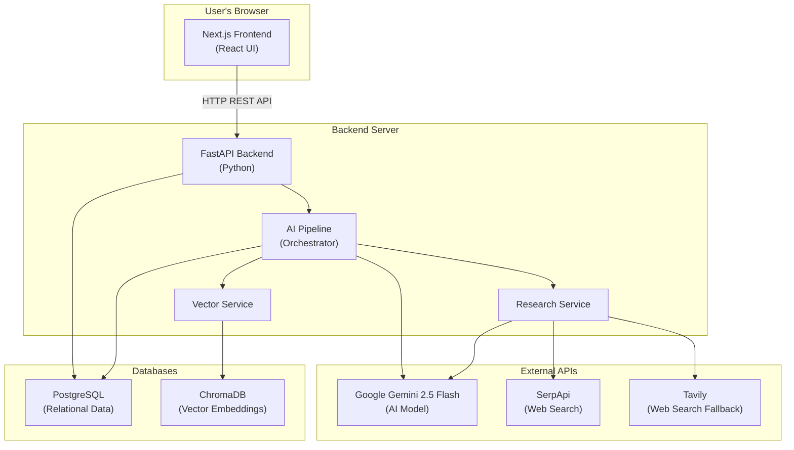
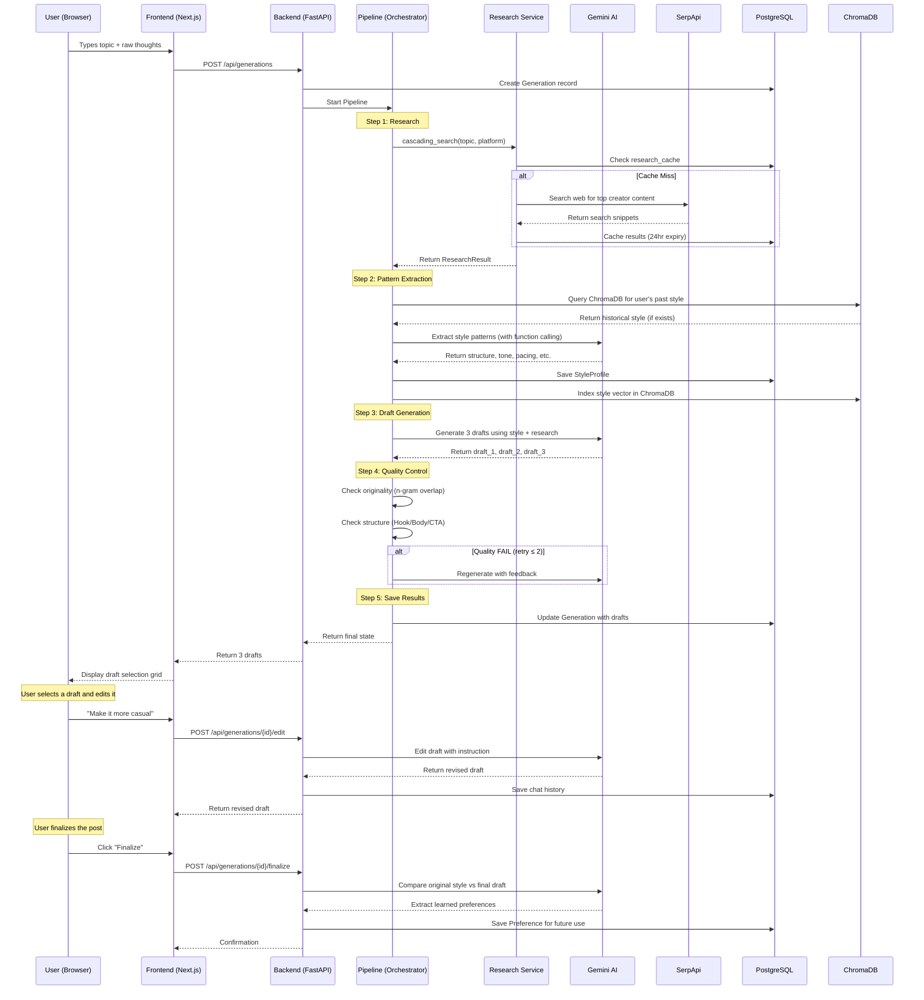
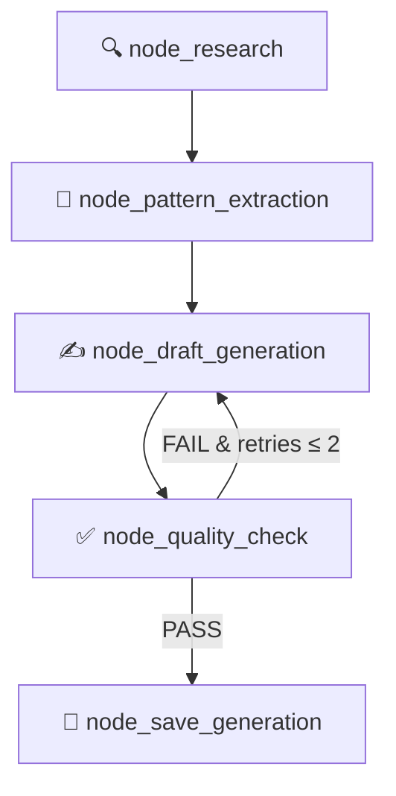
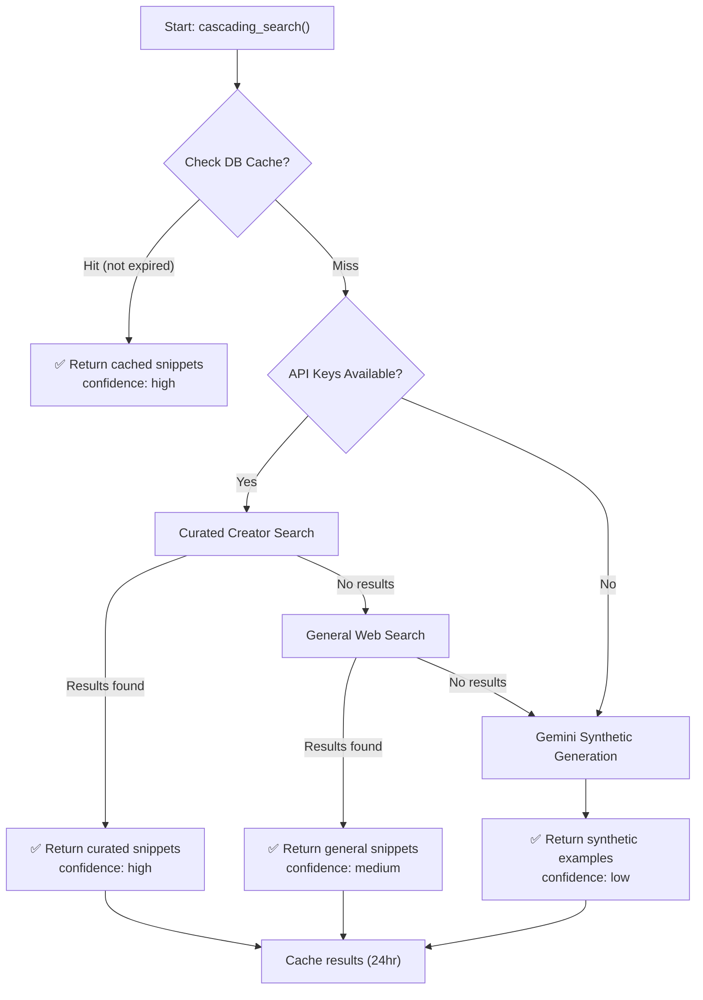
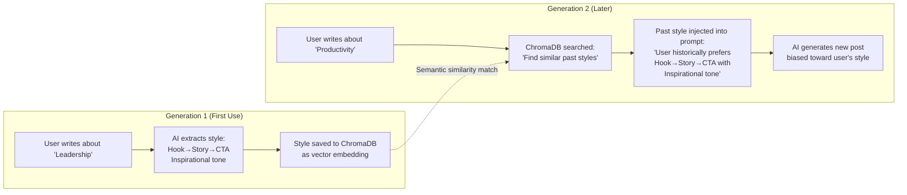
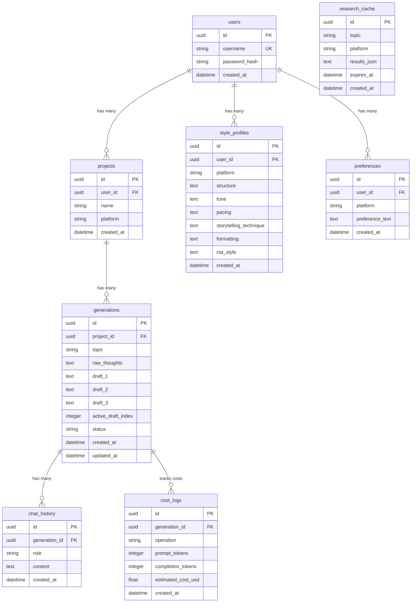
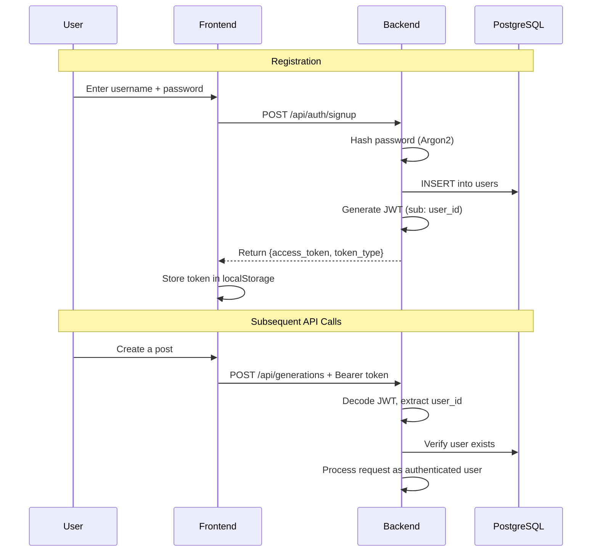
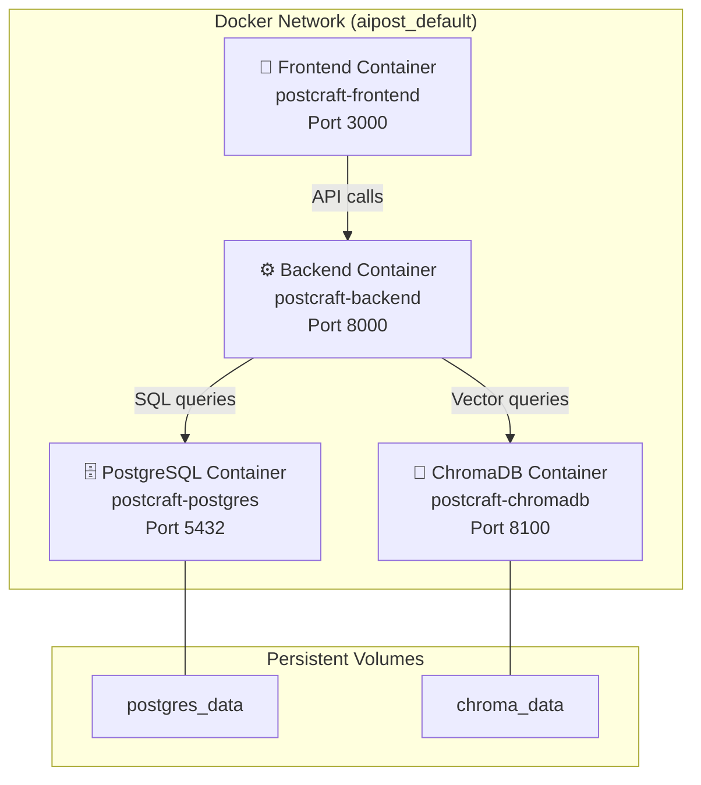

# PostCraft AI — Complete Project Documentation

> **A comprehensive guide covering the concept, architecture, and technical implementation of PostCraft AI — an AI-powered social media content generation platform.**

---

## Table of Contents

1. [What is PostCraft AI?](#1-what-is-postcraft-ai)
2. [The Problem It Solves](#2-the-problem-it-solves)
3. [High-Level Architecture](#3-high-level-architecture)
4. [How Everything Connects — The Big Picture](#4-how-everything-connects--the-big-picture)
5. [The AI Content Generation Pipeline](#5-the-ai-content-generation-pipeline)
6. [The Research Engine](#6-the-research-engine)
7. [The Style Learning System (ChromaDB)](#7-the-style-learning-system-chromadb)
8. [The Conversational Editor](#8-the-conversational-editor)
9. [Database Schema](#9-database-schema)
10. [API Reference](#10-api-reference)
11. [Authentication System](#11-authentication-system)
12. [Frontend (User Interface)](#12-frontend-user-interface)
13. [Infrastructure & Deployment](#13-infrastructure--deployment)
14. [Cost Tracking](#14-cost-tracking)
15. [Technology Stack Summary](#15-technology-stack-summary)
16. [End-to-End User Journey](#16-end-to-end-user-journey)

---

## 1. What is PostCraft AI?

PostCraft AI is an intelligent social media content generation platform that helps users create high-quality, platform-specific posts for LinkedIn and X (formerly Twitter). Unlike generic AI writing tools that produce cookie-cutter content, PostCraft AI:

- **Researches real-world content** from top creators on each platform before writing
- **Learns your personal writing style** over time and biases future generations toward it
- **Generates 3 draft variations** for every request, giving you creative options
- **Runs automated quality control** to ensure originality and structural completeness
- **Provides a conversational editor** where you can iteratively refine drafts with AI assistance
- **Remembers your preferences** so every future post gets better

The core philosophy is: **the AI doesn't just write for you — it learns to write like you.**

---

## 2. The Problem It Solves

Content creators face three main challenges:

| Challenge | How PostCraft AI Solves It |
|---|---|
| **Writer's block** | You provide raw thoughts and a topic; the AI structures them into polished posts |
| **Platform mismatch** | The AI researches platform-specific best practices (LinkedIn vs X have very different styles) |
| **Generic AI output** | The style learning system ensures output progressively matches YOUR unique voice |

---

## 3. High-Level Architecture

PostCraft AI follows a **split architecture** with four core components:



### The Four Pillars

| Component | Technology | Purpose |
|---|---|---|
| **Frontend** | Next.js (React + TypeScript) | The user interface — login, create posts, edit drafts, finalize |
| **Backend** | FastAPI (Python) | REST API server — handles requests, runs the AI pipeline, manages data |
| **PostgreSQL** | PostgreSQL 16 | Stores all structured data — users, projects, generations, preferences, costs |
| **ChromaDB** | ChromaDB 0.5 | Vector database — stores and retrieves writing style embeddings for similarity matching |

---

## 4. How Everything Connects — The Big Picture

Here is the complete data flow from the moment a user types a topic to when they get their finished post:



---

## 5. The AI Content Generation Pipeline

The heart of PostCraft AI is the `PostGenerationPipeline` — a dynamic state machine that orchestrates the entire content creation process. It lives in `backend/app/services/orchestrator.py`.

### Pipeline Nodes (Steps)

The pipeline executes these nodes in sequence:



### Detailed Node Descriptions

#### Node 1: Research (`node_research`)
- Calls the Research Service to find real-world examples of successful posts on the target platform about the given topic
- Returns content snippets that will guide the AI's writing style and structure

#### Node 2: Pattern Extraction (`node_pattern_extraction`)
- **Checks ChromaDB** for the user's historical writing style preferences
- Calls **Gemini 2.5 Flash** with a special "function calling" tool named `extract_style_patterns`
- The AI analyzes the research snippets and extracts 6 style dimensions:
  - **Structure**: e.g., "Hook → Story → CTA"
  - **Tone**: e.g., "Inspirational", "Conversational"
  - **Pacing**: e.g., "Fast", "Measured"
  - **Storytelling Technique**: e.g., "Hero's journey", "Data-driven"
  - **Formatting**: e.g., "Short paragraphs", "Bullet points"
  - **CTA Style**: e.g., "Direct question", "Soft invitation"
- Saves the extracted profile to **PostgreSQL** and indexes it in **ChromaDB** for future similarity searches
- Logs token usage and cost

#### Node 3: Draft Generation (`node_draft_generation`)
- Constructs a detailed prompt combining:
  - The user's raw thoughts and topic
  - The extracted style patterns
  - Research snippets from real creators
  - Any historical style bias from ChromaDB
  - Quality feedback from previous failed attempts (if retrying)
- Calls **Gemini 2.5 Flash** requesting a structured JSON response with exactly 3 draft variations
- Each draft is a complete, ready-to-post piece of content

#### Node 4: Quality Check (`node_quality_check`)
Two automated quality gates:

1. **Originality Check**: Computes 6-word n-gram overlap between the generated drafts and the research snippets. If too much text is copied directly from sources, the draft fails
2. **Structural Completeness**: Validates that each draft contains a proper Hook (opening), Body (main content), and CTA (call-to-action)

If a draft fails quality control:
- The retry counter increments (maximum 2 retries)
- Specific feedback about what failed is injected into the prompt
- The pipeline loops back to `node_draft_generation`

If it passes (or exhausts retries):
- Proceeds to save the results

#### Node 5: Save Generation (`node_save_generation`)
- Updates the `Generation` record in PostgreSQL with `draft_1`, `draft_2`, `draft_3`
- Sets status to `"editing"` (success), `"needs_review"` (failed after retries), or `"failed"` (error)

---

## 6. The Research Engine

The Research Service (`backend/app/services/research.py`) implements a **4-tier cascading fallback strategy** to ensure the AI always has context, even when external APIs are unavailable.



### Tier 1: Database Cache
- Checks PostgreSQL `research_cache` table for unexpired results matching the topic and platform
- Cache entries expire after 24 hours

### Tier 2: Curated Creator Search
- Loads a curated list of top creators for each platform from JSON files:
  - **LinkedIn**: Justin Welsh, Sahil Bloom, Nicolas Cole, Dickie Bush, Alex Hormozi
  - **X (Twitter)**: Naval, Paul Graham, Sahil Lavingia, Dan Koe, Shreyas Doshi
- Constructs a search query biased toward these creators' content
- Uses **SerpApi** (primary) or **Tavily** (fallback) for web search

### Tier 3: General Web Search
- If curated search returns nothing, falls back to a broader search query: `{topic} {platform} post examples`

### Tier 4: Gemini Synthetic Generation
- If no search API keys are configured or all web searches fail, asks **Gemini 2.5 Flash** to generate 3 synthetic structural examples
- This ensures the pipeline never completely fails — it always has some structure to work with

---

## 7. The Style Learning System (ChromaDB)

This is what makes PostCraft AI unique. ChromaDB is a **vector database** that stores mathematical representations (embeddings) of text, allowing the system to find semantically similar content.

### How It Works



### Technical Details
- **Storage**: Each `StyleProfile` is converted to a text string (e.g., `"Structure: Hook→Story→CTA | Tone: Inspirational | Pacing: Fast | ..."`)
- **Embedding**: ChromaDB automatically converts this text into a high-dimensional vector using its built-in embedding model
- **Retrieval**: When generating a new post, the system queries ChromaDB with the current research snippets and filters by `user_id` and `platform`
- **Effect**: The closest matching historical style is injected into the Gemini prompt as "historical preferred style", gently biasing the output

The more posts a user generates and finalizes, the better the system understands their preferences.

---

## 8. The Conversational Editor

After receiving 3 draft variations, the user can select one and refine it through a **chat-based editing interface**.

### How It Works

1. User selects a draft (e.g., Draft 2)
2. User types an instruction like *"Make it more casual and add a personal anecdote"*
3. The system sends the current draft + instruction + full chat history to **Gemini 2.5 Flash**
4. The AI returns a revised version of the draft
5. Both the user's instruction and the AI's revision are saved to `ChatHistory` in PostgreSQL
6. The user can continue editing with more instructions, building on previous changes

### Finalization

When the user is satisfied:
1. They click **"Finalize & Save Preferences"**
2. The system compares the **original AI-generated draft** with the **user's final edited version**
3. Gemini analyzes the differences and extracts what the user changed — their preferences
4. These preferences are saved to the `Preference` table
5. Future generations will incorporate these learned preferences

This creates a **feedback loop**: Generate → Edit → Finalize → Learn → Generate Better.

---

## 9. Database Schema

PostCraft AI uses **PostgreSQL** with 8 tables managed through **Alembic** migrations.



### Table Purposes

| Table | Purpose |
|---|---|
| `users` | Registered user accounts with Argon2-hashed passwords |
| `projects` | Groups generations by user and platform (e.g., "My LinkedIn Project") |
| `generations` | Each post generation attempt — stores topic, thoughts, and 3 draft outputs |
| `style_profiles` | Extracted writing style patterns (structure, tone, pacing, etc.) |
| `chat_history` | Conversation log between user and AI during draft editing |
| `preferences` | Learned user preferences extracted during finalization |
| `research_cache` | Cached web search results (24-hour TTL) to reduce API calls |
| `cost_logs` | Token usage and USD cost tracking for every Gemini API call |

---

## 10. API Reference

### Authentication Endpoints

| Method | Path | Description |
|---|---|---|
| `POST` | `/api/auth/signup` | Create a new account. Returns JWT token |
| `POST` | `/api/auth/login` | Log in with credentials. Returns JWT token |

### Generation Endpoints

| Method | Path | Auth | Description |
|---|---|---|---|
| `POST` | `/api/generations` | ✅ Bearer | Generate 3 post drafts from a topic and raw thoughts |
| `POST` | `/api/generations/{id}/edit` | ✅ Bearer | Send an edit instruction to refine a selected draft |
| `POST` | `/api/generations/{id}/finalize` | ✅ Bearer | Finalize a draft and save learned preferences |

### Administrative Endpoints

| Method | Path | Auth | Description |
|---|---|---|---|
| `GET` | `/api/admin/cost-summary` | ✅ Bearer | View total token usage and costs, broken down by operation |

### Health Check Endpoints

| Method | Path | Description |
|---|---|---|
| `GET` | `/api/health` | Returns backend status, version, and environment |
| `GET` | `/api/health/db` | Tests database connectivity |

---

## 11. Authentication System

PostCraft AI uses industry-standard authentication:

- **Password Hashing**: Argon2 algorithm (winner of the Password Hashing Competition, considered the gold standard)
- **Token Format**: JSON Web Tokens (JWT) signed with HS256
- **Token Lifetime**: 7 days
- **Token Storage**: Frontend stores the JWT in `localStorage`
- **API Protection**: Every protected endpoint requires `Authorization: Bearer <token>` header

### Auth Flow



---

## 12. Frontend (User Interface)

The frontend is a **Single Page Application (SPA)** built with Next.js and React, featuring a dark-mode glassmorphic design.

### User Interface Modes

The frontend operates in 4 sequential modes:

1. **Authentication Mode**
   - Toggle between Login and Signup forms
   - Username + Password input fields
   - JWT token stored on successful authentication

2. **Generation Form**
   - Platform selector (LinkedIn / X)
   - Topic input field
   - Raw Thoughts textarea (your unstructured ideas)
   - "Generate" button triggers the full AI pipeline

3. **Draft Selection Grid**
   - Displays 3 generated draft cards side-by-side
   - Each card has a "Copy to Clipboard" button
   - Clicking a draft selects it for editing

4. **Interactive Editor & Chat**
   - Selected draft displayed in an editable workspace
   - Chat interface with user/assistant message bubbles
   - Text input for sending edit instructions
   - "Finalize & Save Preferences" button to complete the workflow

### Design System
- **Theme**: Full dark mode (`#0a0a0b` background)
- **Accent Color**: Indigo (`#6366f1`)
- **Style**: Glassmorphic cards with backdrop blur
- **Animations**: `fadeInUp`, `fadeInDown` keyframe transitions
- **Typography**: Geist Sans and Geist Mono (Google Fonts)

---

## 13. Infrastructure & Deployment

### Local Development (Docker Compose)

When running locally, Docker Compose orchestrates 4 containers:



### Production Deployment

| Component | Platform | Details |
|---|---|---|
| **Frontend** | Vercel | Automatic CI/CD from GitHub. Every push rebuilds and deploys |
| **Backend** | Railway | Docker-based deployment with auto-scaling |
| **PostgreSQL** | Railway Plugin | Managed database with automatic backups |
| **ChromaDB** | Railway Service | Docker image `chromadb/chroma:0.5.23` with persistent volume |

### Backend Dockerfile (Multi-Stage Build)

```
Stage 1 (Builder):
  python:3.12-slim → Install uv → Create virtualenv → Install all Python dependencies

Stage 2 (Runtime):
  python:3.12-slim → Copy only the virtualenv + app code → Run uvicorn
```

This produces a **minimal, production-ready image** without build tools or package managers, keeping it fast and secure.

---

## 14. Cost Tracking

Every call to Gemini 2.5 Flash is logged with token counts and estimated USD costs.

### Pricing (Gemini 2.5 Flash)

| Metric | Rate |
|---|---|
| Input tokens | $0.30 per 1M tokens |
| Output tokens | $2.50 per 1M tokens |

### Tracked Operations

| Operation | When It Happens |
|---|---|
| `pattern_extraction` | Style analysis using function calling |
| `draft_generation` | Generating 3 post variations |
| `quality_check` | Originality and structural validation |
| `edit` | Each conversational edit instruction |
| `finalize` | Preference extraction during finalization |

The cost summary is accessible via `GET /api/admin/cost-summary`.

---

## 15. Technology Stack Summary

### Backend
| Technology | Version | Purpose |
|---|---|---|
| Python | 3.12 | Core language |
| FastAPI | Latest | Web framework (async) |
| SQLAlchemy | 2.0 | ORM (async) |
| PostgreSQL | 16 | Relational database |
| ChromaDB | 0.5.23 | Vector database |
| Alembic | Latest | Database migrations |
| Google Gemini | 2.5 Flash | AI language model |
| SerpApi | - | Web search |
| Argon2 | - | Password hashing |
| python-jose | - | JWT tokens |
| uv | Latest | Python package manager |

### Frontend
| Technology | Version | Purpose |
|---|---|---|
| Next.js | 15 | React framework |
| React | 19 | UI library |
| TypeScript | 5 | Type-safe JavaScript |

### Infrastructure
| Technology | Purpose |
|---|---|
| Docker | Containerization |
| Docker Compose | Multi-container orchestration |
| Vercel | Frontend hosting (CI/CD) |
| Railway | Backend + database hosting |

---

## 16. End-to-End User Journey

Here is the complete story of what happens when someone uses PostCraft AI:

### First Time User

1. **Sign Up**: User creates an account. Password is hashed with Argon2 and stored. JWT token issued.

2. **Create First Post**: User enters topic "5 Leadership Lessons from My Startup" for LinkedIn, along with some raw thoughts.

3. **Research Phase**: The system searches the web for how top LinkedIn creators (Justin Welsh, Sahil Bloom, etc.) write about leadership. Results are cached for 24 hours.

4. **Style Extraction**: Since this is the first generation, there's no historical style in ChromaDB. The AI analyzes the research snippets and extracts the dominant style patterns (structure, tone, pacing, etc.).

5. **Draft Generation**: Using the extracted style + research + user's raw thoughts, Gemini generates 3 unique draft variations.

6. **Quality Control**: Each draft is checked for originality (no plagiarism from sources) and structural completeness (Hook/Body/CTA). If any draft fails, it's regenerated with specific feedback.

7. **User Reviews Drafts**: The 3 drafts appear in the UI. The user reads them and selects Draft 2.

8. **Conversational Editing**: The user says "Make the opening hook more attention-grabbing and add a personal failure story." The AI revises Draft 2 accordingly. The user continues with "Shorten the CTA to one sentence." The AI complies.

9. **Finalization**: The user clicks "Finalize." The system compares the original Draft 2 with the final edited version, extracts what the user changed (preferences), and saves them.

10. **Style Profile Saved**: The extracted style is saved to both PostgreSQL and ChromaDB as a vector embedding.

### Returning User (The Magic)

11. **Create Second Post**: Same user, new topic: "Why Remote Work is the Future."

12. **ChromaDB Bias**: During pattern extraction, the system queries ChromaDB and finds the user's previous style profile. It injects this into the prompt as "historical preferred style."

13. **Better Output**: The new drafts are naturally biased toward the user's proven style — same structure, similar tone, matching pacing — but applied to the new topic.

14. **Continuous Learning**: With every generation → edit → finalize cycle, the system builds a richer understanding of the user's preferences.

---

> **PostCraft AI doesn't just generate content — it builds a personalized AI writing partner that gets better with every use.**
