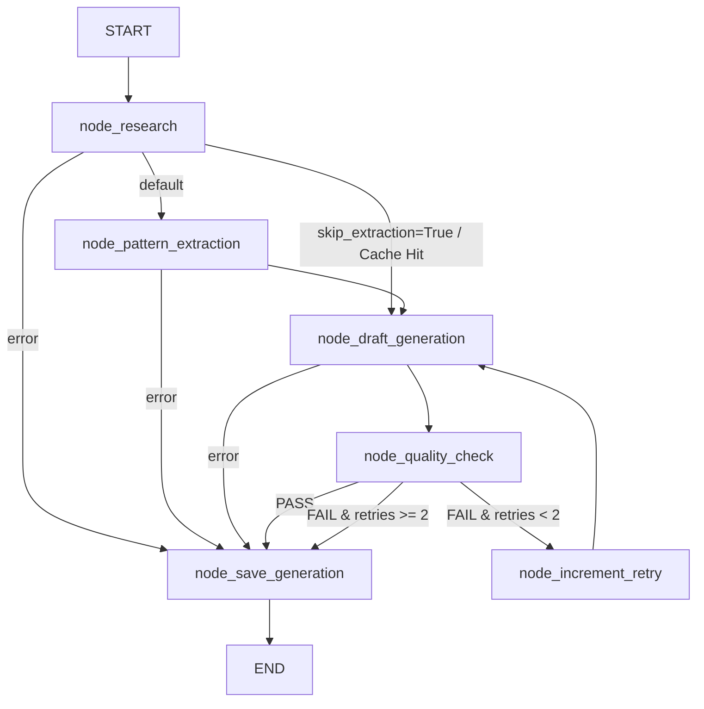

# PostCraft AI

An AI-powered Content Research & Writing Platform for LinkedIn and X (Twitter) built on **LangGraph** and **Google Gemini 2.5 Flash**.

PostCraft researches live public discussions on a topic, extracts high-leverage **writing patterns** (structure, tone, pacing, storytelling technique, formatting, CTA style), combines those patterns with the user's raw thoughts and **profile context**, and generates conversion-focused, high-engagement draft posts. Through a conversational editor and vector memory (ChromaDB), the system continuously adapts to the user's voice and business goals.

---

## Key Features

- **LangGraph State Machine**: Robust, typed workflow orchestration with conditional routing, automated quality gates, and structured retry loops.
- **Lead-Gen & Conversion-First CTAs**: Replaces generic engagement bait ("Thoughts?", "Agree?") with high-converting Call-to-Actions customized to the user's specific bio, role, or product.
- **Cascading Research Engine**: Multi-tiered search (DB Cache → Curated Top Creators → General Search → Synthetic Structure) ensuring real-world context on any topic.
- **Vector Memory (ChromaDB)**: Learns and indexes your historical writing style to bias future generations toward your unique voice.
- **Conversational Iteration**: Chat-based inline editor to refine drafts and extract user preferences upon finalization.

---

## Architecture & Pipeline Topology

PostCraft AI uses a compiled **LangGraph `StateGraph`** (`backend/app/services/pipeline/`) with explicit state transitions:



---

## Tech Stack

| Layer | Technology | Purpose |
|---|---|---|
| **Pipeline Framework** | LangGraph (>=1.2.0) | Stateful workflow orchestration & conditional routing |
| **LLM Integration** | langchain-google-genai (2.1+) | Structured LLM output & function calling with Gemini 2.5 Flash |
| **Backend** | FastAPI (Python 3.12) | High-performance asynchronous REST API |
| **Frontend** | Next.js 16 (React 19, TypeScript) | Modern UI with Tailwind CSS & shadcn/ui primitives |
| **Primary Database** | PostgreSQL 16 + SQLAlchemy (async) | Relational persistence & Alembic migrations |
| **Vector Database** | ChromaDB (0.5.23) | Vector embeddings for style learning & retrieval |
| **Web Research** | SerpApi / Tavily | Curated creator & live web research |
| **Deployment** | Docker & Docker Compose | Containerized multi-stage builds |

---

## Local Development Setup

### Prerequisites

- [Docker](https://docs.docker.com/get-docker/) and Docker Compose
- [Node.js](https://nodejs.org/) 20+ and npm
- Python 3.12+ (or [uv](https://docs.astral.sh/uv/) for direct local backend development)

### 1. Configure Environment

```bash
cd backend
cp .env.example .env
# Add your GEMINI_API_KEY (and optional SERP_API_KEY / TAVILY_API_KEY)
```

### 2. Start Services via Docker Compose

```bash
# From project root
docker-compose up --build
```

This boots:
- **PostgreSQL** on port `5432`
- **ChromaDB** on port `8100`
- **FastAPI Backend** on port `8000`

### 3. Run Database Migrations

```bash
# Inside backend directory
$env:PYTHONPATH="."; .venv\Scripts\alembic upgrade head
# Or via uv / standard python
python -m alembic upgrade head
```

### 4. Run the Frontend

```bash
cd frontend
npm install
npm run dev
# Open http://localhost:3000
```

### 5. Health Checks

```bash
curl http://localhost:8000/api/health
# → {"status":"healthy","version":"0.1.0","environment":"development"}

curl http://localhost:8000/api/health/db
# → {"status":"connected"}
```

---

## Environment Variables

| Variable | Required | Description |
|---|---|---|
| `DATABASE_URL` | Yes | PostgreSQL connection string (`postgresql+asyncpg://...`) |
| `GEMINI_API_KEY` | Yes | Google Gemini API key (Gemini 2.5 Flash) |
| `SERP_API_KEY` | No | SerpApi key for Google search research |
| `TAVILY_API_KEY` | No | Tavily search API key (fallback research) |
| `CHROMA_HOST` | No | ChromaDB host (default: `localhost` or `chromadb`) |
| `CHROMA_PORT` | No | ChromaDB port (default: `8000`) |
| `ENVIRONMENT` | No | `development` / `production` |
| `DEBUG` | No | Enable debug mode (default: `True`) |
| `CORS_ORIGINS` | No | Allowed CORS origins (default: `["http://localhost:3000"]`) |

---

## Running Tests

```bash
cd backend
$env:PYTHONPATH="."; pytest -v
```

---

## Repository Structure

```
postcraft-ai/
├── docker-compose.yml              # Local development orchestration
├── docker-compose.prod.yml         # Production container definition
├── README.md                       # Main project overview & quickstart
├── PostCraft_AI_Complete_Documentation.md # Deep technical architecture documentation
├── backend/
│   ├── pyproject.toml              # Python dependencies & metadata
│   ├── Dockerfile                  # Multi-stage production container build
│   ├── alembic/                    # Database migrations
│   ├── creators/                   # Curated top creator lists for LinkedIn & X
│   └── app/
│       ├── main.py                 # FastAPI application entrypoint
│       ├── models.py               # SQLAlchemy database models
│       ├── core/                   # Foundation & infrastructure
│       │   ├── config.py           # Pydantic settings & env management
│       │   ├── database.py         # Async SQLAlchemy engine & session factory
│       │   └── security.py         # Password hashing (Argon2) & JWT tokens
│       ├── api/                    # API route handlers (auth, generations, users, editor, admin)
│       ├── schemas/                # External API request/response schemas
│       └── services/
│           ├── research.py         # Cascading search engine
│           ├── vector.py           # ChromaDB vector operations
│           └── pipeline/           # LangGraph Post Generation Pipeline
│               ├── graph.py        # StateGraph topology, conditional edges, MAX_RETRIES
│               ├── nodes.py        # Async node worker functions
│               ├── prompts.py      # Lead-gen & engagement prompt templates
│               ├── state.py        # GraphState TypedDict & structured schemas
│               ├── deps.py         # Dependency container (session, llm, settings)
│               ├── pipeline.py     # PostGenerationPipeline runtime entrypoint
│               └── README.md       # LangGraph study guide & topology map
└── frontend/
    ├── package.json
    ├── Dockerfile                  # Standalone Next.js container build
    └── src/
        ├── app/                    # Next.js App Router (page.tsx, globals.css)
        ├── components/             # Reusable UI & layout components
        ├── features/               # Domain features (auth, generation, editor)
        └── lib/                    # API clients (generation, user, auth, client)
```

---

## License

Proprietary — All rights reserved.
