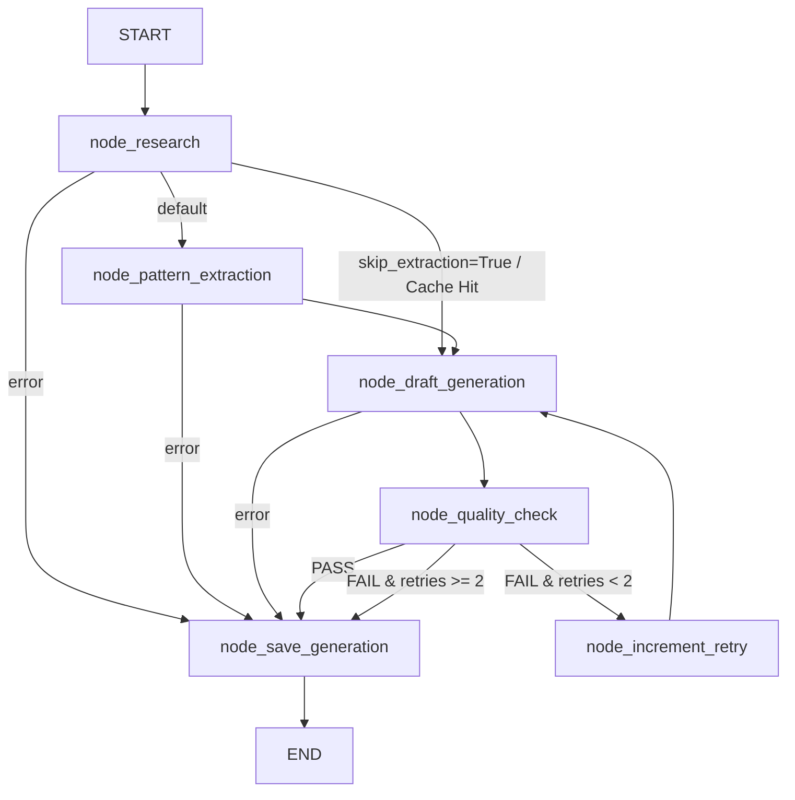

# PostCraft AI

An AI-powered content ghostwriting platform for LinkedIn and X (Twitter) built on **LangGraph** and **Google Gemini 2.5 Flash**.

PostCraft researches live public discussions on a topic, extracts high-leverage **writing patterns** (structure, tone, pacing, storytelling technique, formatting, CTA style), combines those patterns with the user's raw thoughts and **profile context**, and generates conversion-focused, high-engagement draft posts. Through a conversational editor and vector memory (ChromaDB), the system continuously adapts to the user's voice and business goals.

---

## Key Features

- **LangGraph State Machine**: Robust, typed workflow orchestration with conditional routing, automated quality gates, and structured retry loops.
- **Lead-Gen & Conversion-First CTAs**: Replaces generic engagement bait ("Thoughts?", "Agree?") with high-converting Call-to-Actions customized to the user's specific bio, role, or product.
- **Cascading Research Engine**: Multi-tiered search (DB Cache → Curated Top Creators → General Search → Synthetic Structure) ensuring real-world context on any topic.
- **Vector Memory (ChromaDB)**: Learns and indexes your historical writing style to bias future generations toward your unique voice.
- **Conversational Iteration**: Chat-based inline editor to refine drafts and extract user preferences upon finalization.
- **Persona Engine**: Structured profile fields (About Me, Resume & Background, Writing Style Profile) that sharpen every generation to read like you.
- **Rate-Limited Protection**: Per-user rate limits on all write endpoints prevent abuse and runaway costs.
- **Privacy & ToS**: Privacy Policy and Terms of Service rendered in-app; required agreement checkbox on sign-up; full GDPR disclosure.
- **Account Deletion**: Self-serve account deletion that cascades across PostgreSQL and ChromaDB — verified by typed username confirmation.

---

## Architecture & Pipeline Topology

PostCraft AI uses a compiled **LangGraph `StateGraph`** (`backend/app/services/pipeline/`) with explicit state transitions:



---

## Tech Stack

| Layer | Technology | Purpose |
|---|---|---|
| **Pipeline Framework** | LangGraph (>=1.2.0) | Stateful workflow orchestration & conditional routing |
| **LLM Integration** | langchain-google-genai (2.1+) | Structured LLM output & function calling with Gemini 2.5 Flash |
| **Backend** | FastAPI (Python 3.12) | High-performance asynchronous REST API |
| **Frontend** | Next.js 16 (React 19, TypeScript) | Modern UI with Tailwind CSS & shadcn/ui primitives |
| **Primary Database** | PostgreSQL 16 + SQLAlchemy (async) | Relational persistence & Alembic migrations |
| **Vector Database** | ChromaDB (0.5.23) | Vector embeddings for style learning & retrieval |
| **Web Research** | SerpApi / Tavily | Curated creator & live web research |
| **Reverse Proxy / TLS** | Caddy 2 | Automatic HTTPS via Let's Encrypt, reverse proxy |
| **Deployment** | Docker & Docker Compose | Containerized multi-stage builds |

---

## Local Development Setup

### Prerequisites

- [Docker](https://docs.docker.com/get-docker/) and Docker Compose
- [Node.js](https://nodejs.org/) 20+ and npm
- Python 3.12+ (or [uv](https://docs.astral.sh/uv/) for direct local backend development)

### 1. Configure Environment

```bash
cd backend
cp .env.example .env
# Required:
#   - GEMINI_API_KEY
#   - JWT_SECRET_KEY  (generate with: openssl rand -hex 32)
# Optional:
#   - SERP_API_KEY / TAVILY_API_KEY  (web research)
#   - RESUME_ENCRYPTION_KEY          (generate with: openssl rand -hex 32)
```

### 2. Start Services via Docker Compose (local)

```bash
# From project root
docker-compose up --build
```

This boots:
- **PostgreSQL** on port `5432`
- **ChromaDB** on port `8100` (mapped from 8000 internally)
- **FastAPI Backend** on port `8000`
- **Next.js Frontend** on port `3000`

### 3. Run Database Migrations

```bash
cd backend
$env:PYTHONPATH="."; .venv\Scripts\alembic upgrade head
# Or via uv / standard python
python -m alembic upgrade head
```

### 4. Run the Frontend

```bash
cd frontend
npm install
npm run dev
# Open http://localhost:3000
```

### 5. Health Checks

```bash
curl http://localhost:8000/api/health
# → {"status":"healthy","version":"0.1.0","environment":"development"}

curl http://localhost:8000/api/health/db
# → {"status":"connected"}
```

---

## Environment Variables

| Variable | Required | Description |
|---|---|---|
| `DATABASE_URL` | Yes | PostgreSQL connection string (`postgresql+asyncpg://...`) |
| `GEMINI_API_KEY` | Yes | Google Gemini API key (Gemini 2.5 Flash) |
| `JWT_SECRET_KEY` | Yes | JWT signing secret — **must be at least 32 chars**. Fail-closed at startup if missing or too short. Generate with `openssl rand -hex 32`. |
| `RESUME_ENCRYPTION_KEY` | No | Fernet (AES-128-CBC + HMAC) key for encrypting resume PII at rest. Generate with `openssl rand -hex 32`. If absent, encryption is skipped but a warning is logged. |
| `SERP_API_KEY` | No | SerpApi key for Google search research |
| `TAVILY_API_KEY` | No | Tavily search API key (fallback research) |
| `CHROMA_HOST` | No | ChromaDB host (default: `localhost` or `chromadb` in Docker) |
| `CHROMA_PORT` | No | ChromaDB port (default: `8000`) |
| `ENVIRONMENT` | No | `development` / `production` |
| `CORS_ORIGINS` | No | Allowed CORS origins (default: `["http://localhost:3000"]`) |
| `SENTRY_DSN` | No | Sentry error tracking DSN (activates error monitoring when set) |
| `POSTCRAFT_DOMAIN` | Prod | Domain for TLS cert issuance (e.g. `app.yourdomain.com`) |
| `POSTCRAFT_ADMIN_EMAIL` | Prod | Admin email for Let's Encrypt expiry notices |

---

## Rate Limits

All write endpoints are protected by per-user rate limits via `slowapi`:

| Endpoint | Limit |
|---|---|
| `POST /api/auth/login` | 5 requests / minute |
| `POST /api/auth/signup` | 3 requests / minute |
| `POST /api/generations` | 10 requests / hour |
| `POST /api/generations/{id}/edit` | 20 requests / hour |
| `POST /api/generations/{id}/finalize` | 30 requests / hour |

When a 429 is returned, the response includes a `Retry-After` header (seconds). The frontend surfaces this as a clear toast: *"Please wait N minutes and try again."*

---

## Security Model

- **JWT secrets**: Fail-closed at startup — the app refuses to start if `JWT_SECRET_KEY` is missing or under 32 characters.
- **Resume PII**: Encrypted at rest with Fernet (AES-128-CBC + HMAC-SHA256). Decryption fails-closed if the key is absent or corrupted.
- **DB TLS**: Production connections use `sslmode=require`.
- **Security headers**: CSP, `X-Content-Type-Options`, `X-Frame-Options`, `Referrer-Policy`, HSTS (1-year pin) applied via middleware.
- **Trusted Host**: `TrustedHostMiddleware` blocks Host-header attacks in production.
- **Account deletion**: Cascades via SQLAlchemy `cascade="all, delete-orphan"` across all user-owned rows in PostgreSQL and explicitly cleans ChromaDB vectors.
- **Sentry**: Wired in `main.py`, activates only when `SENTRY_DSN` is set. Does not send PII (drafts, resume text, chat history are excluded).
- **XSS sanitization**: All AI-generated draft content is sanitized via DOMPurify before rendering.
- **Caddy TLS**: Production uses Caddy 2 as a reverse proxy with automatic Let's Encrypt certificate issuance and renewal. Backend and frontend are not publicly exposed — only Caddy has public ports (80 + 443).

---

## Privacy & Legal

- **Privacy Policy** and **Terms of Service** are rendered in-app at `/privacy` and `/terms` views, accessible from the auth screen footer and the sidebar (logged-in).
- Sign-up requires an explicit "I agree to the Terms of Service and Privacy Policy" checkbox — the submit button is disabled until checked.
- **GDPR**: Additional disclosures for EU/UK users are included in the Terms view.
- See `PRIVACY.md` for the full legal document (last updated 2026-09-05).

---

## Running Tests

```bash
cd backend
$env:PYTHONPATH="."; pytest -v
```

---

## Repository Structure

```
postcraft-ai/
├── docker-compose.yml              # Local development orchestration
├── docker-compose.prod.yml         # Production container definition (Caddy TLS, no public ports)
├── Caddyfile                      # Caddy reverse proxy config (auto-https)
├── README.md                      # This file
├── PRIVACY.md                     # Privacy Policy, ToS, GDPR notes
├── DEPLOYMENT.md                  # Pre-launch checklist
├── PostCraft_AI_Complete_Documentation.md  # Deep technical architecture reference
├── PROJECT_MASTERY_GUIDE.md       # Engineering teaching guide
│
├── backend/
│   ├── pyproject.toml
│   ├── Dockerfile                 # Multi-stage production build
│   ├── start.sh                  # Runs encryption migration, then uvicorn
│   ├── alembic/                  # DB migrations
│   │   └── versions/             # Individual migration files
│   ├── creators/                 # Curated top creator lists
│   ├── app/
│   │   ├── main.py              # FastAPI entrypoint, Sentry, security headers, middleware
│   │   ├── models.py            # SQLAlchemy models (User, Generation, StyleProfile, etc.)
│   │   ├── core/
│   │   │   ├── config.py        # Pydantic Settings (env vars, JWT fail-closed)
│   │   │   ├── database.py      # Async SQLAlchemy engine & session factory
│   │   │   ├── security.py      # Argon2 password hashing & JWT (fail-closed)
│   │   │   ├── crypto.py        # Fernet resume encryption (fail-closed)
│   │   │   └── migrate_resume_encryption.py  # One-time plaintext→encrypted migration
│   │   ├── api/
│   │   │   ├── auth.py          # POST /api/auth/signup, /api/auth/login + rate limits
│   │   │   ├── users.py         # GET/PATCH/DELETE /api/users/me, resume upload/delete
│   │   │   ├── generations.py    # POST /api/generations (rate-limited)
│   │   │   ├── editor.py        # POST /api/generations/{id}/edit, /finalize (rate-limited)
│   │   │   ├── admin.py         # GET /api/admin/cost-summary
│   │   │   └── health.py        # GET /api/health, /api/health/db
│   │   ├── schemas/
│   │   │   ├── api.py
│   │   │   ├── editor.py
│   │   │   └── research.py
│   │   └── services/
│   │       ├── research.py      # 4-tier cascading search engine
│   │       ├── vector.py        # ChromaDB vector ops (+ delete_all_for_user)
│   │       ├── resume.py        # Resume text extraction + Gemini summarization
│   │       └── pipeline/       # LangGraph Post Generation Pipeline
│   │           ├── deps.py
│   │           ├── state.py
│   │           ├── prompts.py
│   │           ├── nodes.py
│   │           ├── graph.py
│   │           └── pipeline.py
│
└── frontend/
    ├── package.json
    ├── Dockerfile
    ├── Caddyfile               # Local Caddy config for production-like TLS
    ├── next.config.ts
    ├── tailwind.config.ts
    └── src/
        ├── app/
        │   ├── layout.tsx       # Root layout with theme provider
        │   ├── page.tsx         # Main workspace (view dispatcher: home/editor/profile/history/privacy/terms)
        │   └── globals.css      # Design tokens (violet/magenta light, red/amber dark)
        ├── components/
        │   ├── layout/
        │   │   ├── app-shell.tsx   # Full sidebar + header wrapper
        │   │   ├── sidebar.tsx     # Nav, theme toggle, user row, legal footer links
        │   │   └── top-header.tsx  # Page title header
        │   ├── ui/               # shadcn/ui primitives (Dialog, Button, etc.)
        │   └── theme-provider.tsx
        ├── features/
        │   ├── auth/            # AuthScreen, useAuth hook
        │   ├── generation/      # GenerationForm
        │   ├── editor/          # DraftEditor, DraftSelectionGrid
        │   ├── home/            # HomeView (greeting, quick capture)
        │   ├── history/         # HistoryList
        │   ├── profile/         # ProfilePage (Persona Engine + Danger Zone)
        │   └── legal/           # LegalView (Privacy Policy / ToS / GDPR via react-markdown)
        └── lib/
            └── api/
                ├── client.ts    # Central fetch client (429 handling, 401 → auth-expired)
                ├── auth.ts
                ├── user.ts      # getCurrentUser, updateCurrentUser, deleteMyAccount
                └── generation.ts
```

---

## License

Proprietary — All rights reserved.
