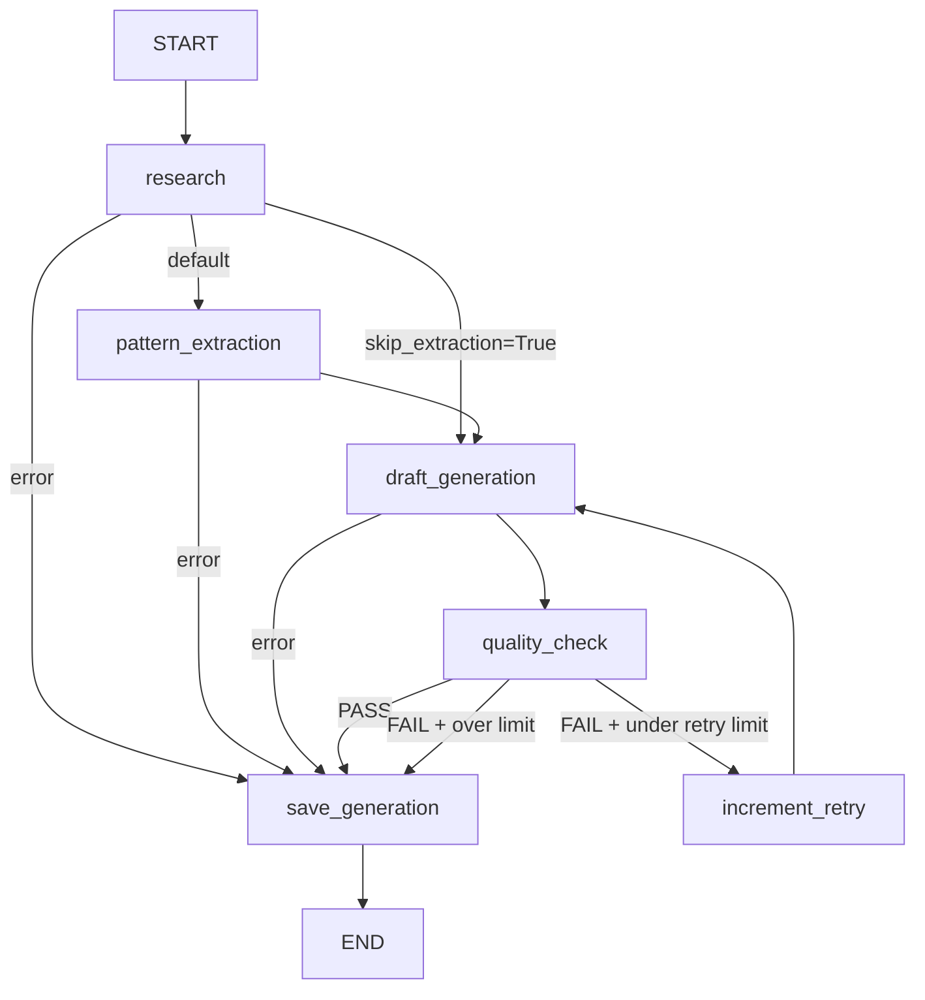

# PostCraft AI — LangGraph Generation Pipeline

This package handles the core AI post generation workflow. It is built using **LangGraph** to model the generation process as a state machine.

## How to learn LangGraph from this codebase

If you are learning LangGraph, this package is designed as a practical tutorial. 
Start by reading `graph.py` — it contains a module-level docstring that points out exactly where the 4 key LangGraph concepts (State, Nodes, Edges, Compiled Graph) are used.

## Architecture & File Structure

This module is split into focused files to make dependencies explicit and testing easier:

- `pipeline.py`: The public entry point. Exposes `PostGenerationPipeline`, which initializes dependencies and triggers the graph.
- `graph.py`: Defines the **topology** of the pipeline. What node runs after what, under what conditions. Edit this if you want to add a new step (e.g. a "translate" node).
- `nodes.py`: The actual **work** of the pipeline. Each function takes the graph state, performs an action (like calling an LLM), and returns state updates. Edit this if you want to change *how* a step works (e.g. adding a new tool call to research).
- `prompts.py`: All LLM prompt templates and rules (e.g. lead-gen rules, engagement rules). Edit this if you want to change *what* the LLM outputs or how it is judged.
- `state.py`: Defines `GraphState` (the internal dict that flows through the graph) and Pydantic schemas for structured LLM outputs.
- `deps.py`: Dependency injection container (`PipelineDeps`). Passed to every node to avoid global variables and closures.

## Modifying the Pipeline

**To change how lead-gen CTAs are judged or generated:**
Edit `prompts.py` (specifically `LEAD_GEN_RULES` or `QUALITY_CHECK_PROMPT`), not `nodes.py`.

**To change how many times the pipeline retries:**
Edit `MAX_RETRIES` in `graph.py` or `nodes.py`.

**To add a new data field to the pipeline:**
1. Add it to `GraphState` and `PipelineState` in `state.py`.
2. Update the initial state mapping in `pipeline.py`.
3. Read/write it in `nodes.py`.

## Graph Topology

